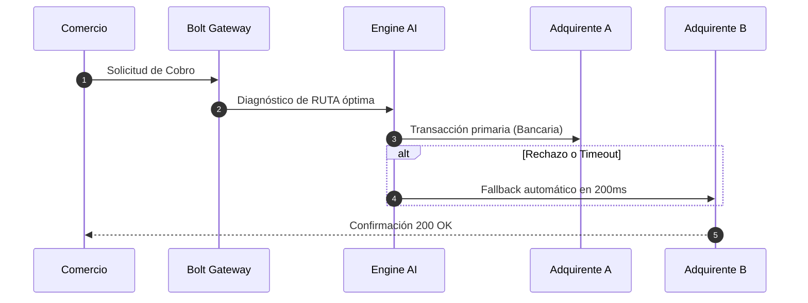

# Bolt Slides Engine: Presentaciones Web Interactivas

## Descripción
`bolt-slides` (StackBlitz) es un motor de presentaciones web nativas impulsado por Markdown, Slidev y Vite. Permite construir decks ejecutivos interactivas, con soporte para componentes en vivo, animaciones con Anime.js, diagramas Mermaid, código ejecutable y diseño editorial de alta densidad visual.

---

## 1. Estructura Básica de Presentación (slides.md)

Las diapositivas se escriben en Markdown estándar separadas por tres guiones (`---`).

```markdown
---
theme: default
background: '#0d1117'
class: text-center
highlighter: shiki
lineNumbers: true
drawings:
  persist: false
transition: slide-left
title: CPS OS - Business Case Defense
---

# CPS OS & Enterprise Payments
### Estrategia de Aceleración de Pipeline B2B en LATAM

<div class="pt-12">
  <span @click="$slidev.nav.next" class="px-4 py-2 rounded font-mono text-sm bg-emerald-600 hover:bg-emerald-500 text-white cursor-pointer transition">
    Iniciar Presentación →
  </span>
</div>

---

# 1. El Problema Operativo en Adquirencia

<div class="grid grid-cols-2 gap-4 mt-8">
  <div class="bg-gray-900/60 p-6 rounded-lg border border-gray-800">
    <h3 class="text-rose-400 font-bold">Fricción Actual</h3>
    <ul class="text-sm opacity-80 space-y-2 mt-4">
      <li>Comisión cobrada sobre ticket total (IEPS + IVA)</li>
      <li>Fuga operativa en conciliación de múltiples sucursales</li>
      <li>Tasa de aprobación caída en picos de tráfico</li>
    </ul>
  </div>
  
  <div class="bg-gray-900/60 p-6 rounded-lg border border-emerald-500/30">
    <h3 class="text-emerald-400 font-bold">Solución Orquestada</h3>
    <ul class="text-sm opacity-80 space-y-2 mt-4">
      <li>Orquestación multi-adquirente en tiempo real</li>
      <li>Conciliación automática por sucursal</li>
      <li>Desglose transparente sobre carga base</li>
    </ul>
  </div>
</div>
```

---

## 2. Componentes Interactivos en Vivo (Vue / HTML Widgets)

Puedes embeber widgets interactivos dentro de cualquier slide (ej. calculadoras de ROI o velocímetros socráticos).

```html
<!-- Slidev Componente Dinámico de Calculadora de COI -->
<template>
  <div class="p-6 bg-slate-900 rounded-xl border border-slate-800">
    <h4 class="text-lg font-bold text-white mb-4">Calculadora de Fuga Transaccional</h4>
    
    <div class="flex items-center gap-4">
      <label class="text-sm text-slate-400">Volumen Mensual ($ MXN):</label>
      <input type="range" min="500000" max="10000000" step="500000" v-model="volume" class="w-48" />
      <span class="font-mono text-emerald-400">${{ Number(volume).toLocaleString() }}</span>
    </div>

    <div class="mt-6 p-4 bg-emerald-950/40 border border-emerald-500/30 rounded-lg">
      <div class="text-xs text-emerald-300">Ahorro Anual Estimado:</div>
      <div class="text-2xl font-bold text-emerald-400">${{ (volume * 0.015 * 12).toLocaleString() }} MXN</div>
    </div>
  </div>
</template>
```

---

## 3. Diagramas de Arquitectura (Mermaid Integration)

```markdown
---

# Diagrama de Orquestación de Pagos


---
```

---

## 4. Reglas de Presentación para Paneles de Negocio (Business Case Defense)
1. **Regla de 1 Idea por Diapositiva:** No saturar de texto; usar listas de máximo 3 puntos.
2. **Navegación Teclado & Clicker:** Usar las flechas del teclado o controladores web para mantener la fluidez.
3. **Modo Presentador:** Presionar la tecla `P` en Slidev para abrir la pantalla de notas privadas para el presentador con temporizador en vivo.
