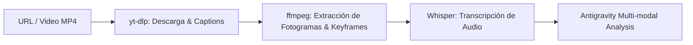

# 🎬 Skill: Claude Video Analyzer (Watch Engine)

Esta habilidad le otorga a los agentes de Antigravity la capacidad de ingerir, transcribir y analizar contenido en video (YouTube, TikTok, Vimeo, webinars o grabaciones locales MP4) para inteligencia competitiva, auditorías de producto y benchmarking.

---

## 📌 Cuándo usar esta Skill

Usa esta skill cuando el usuario o un agente necesite:
1. Extraer puntos clave, precios o demos presentadas en webinars de competidores (ej. Mambu, Incode, Fiserv, Backbase).
2. Transcribir y generar resúmenes ejecutivos de grabaciones de reuniones o demos de ventas B2B.
3. Analizar la secuencia temporal de la interfaz gráfica en grabaciones de pantalla para detectar fallas de UX/UI.

---

## ⚙️ Arquitectura & Pipeline

El pipeline de análisis consta de 3 etapas secuenciales:



### 1. Ingesta y Capturas (`yt-dlp`)
- Descarga el audio nativo y pistas de subtítulos en formato `.vtt` / `.srt`.
- Si el video es público y cuenta con subtítulos nativos, omite la necesidad de procesamiento pesado.

### 2. Extracción de Frames Clave (`ffmpeg`)
- Extrae fotogramas basados en cambios de escena (*scene-aware keyframes*) con un tope configurable (ej. 50 o 100 fotogramas).
- Aplica deduplicación de imágenes para no saturar el presupuesto de tokens con diapositivas estáticas.

### 3. Transcripción con IA (Whisper)
- Si no existen subtítulos nativos, utiliza Whisper (`whisper-large-v3` vía Groq o `whisper-1` vía OpenAI) para convertir el audio en texto con marcas de tiempo exactas.

---

## 🛠️ Comandos y Parámetros de Referencia

Si cuentas con las herramientas instaladas en el sistema host (`yt-dlp`, `ffmpeg`), puedes ejecutar los scripts de análisis con las siguientes banderas:

- **Rango enfocado:** `--start 02:15 --end 05:45` (optimiza consumo de tokens procesando solo la sección de interés).
- **Modos de Detalle:**
  - `transcript`: Solo procesa texto/subtítulos (máxima velocidad).
  - `efficient`: Máximo 50 fotogramas (ideal para demos cortas).
  - `balanced`: Máximo 100 fotogramas con detección de cambios de escena.

---

## 🎙️ Plantilla de Prompt para Inteligencia Comercial

Cuando proceses un video de un competidor, estructura el reporte final con el siguiente formato:

```markdown
# 📹 Informe de Inteligencia de Video: [Título del Video]

## 1. Resumen Ejecutivo (TL;DR)
- Puntos principales presentados.
- Audiencia objetivo y propuesta de valor central.

## 2. Hallazgos Competitivos & Pricing
- Cifras, tiers de precios o modelos de cobro mencionados.
- Integraciones técnicas presentadas.

## 3. Marcas de Tiempo Relevantes
- [MM:SS] Demostración de módulo X.
- [MM:SS] Mención de clientes o casos de éxito.
```
