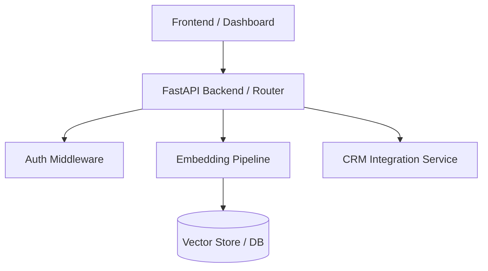

# 🧠 Codebase Knowledge Graph Specialist (`codebase-knowledge-graph`)

Esta skill proporciona las reglas, metodologías y prompts estructurados para mapear repositorios de software completos en **Grafos de Conocimiento de Arquitectura (Architecture Knowledge Graphs)** interactivos y visuales antes de realizar cambios de código o refactorizaciones complejas.

Inspirado en los principios de **`Egonex-AI/Understand-Anything`**.

---

## 📌 ¿Cuándo usar esta Skill?

- Al ingresar por primera vez a un repositorio mediano o grande (más de 15 archivos).
- Antes de planificar cambios arquitectónicos, migraciones o refactorizaciones de impacto.
- Al depurar errores donde la causa raíz puede ser el efecto secundario de un servicio o módulo distante.

---

## 🛡️ Protocolo de 4 Pasos para el Mapeo de Arquitectura

### Paso 1: Descubrimiento Estructural (Sin Suposiciones)
El agente debe inspeccionar los archivos clave del repositorio (archivos de configuración, ruteadores, schemas de DB, utilidades principales) para identificar:
- **Nodos Principales:** Entidades de base de datos, clases core, endpoints API, componentes UI principales.
- **Relaciones:** Dependencias, llamadas entre funciones, eventos asíncronos y relaciones entidad-relación.

### Paso 2: Construcción del Diagrama Mermaid
Generar un diagrama `mermaid` limpio en el documento de implementación o en la conversación:

### Paso 3: Análisis de Impacto (Blast Radius)
Antes de editar cualquier función o schema:
1. Identificar todos los puntos de consumo (*callers*) de la función o API objetivo.
2. Evaluar si el cambio modifica el contrato (tipos, argumentos, retorno).
3. Documentar en una lista explícita de "Archivos Afectados".

### Paso 4: Verificación Empírica
Tras aplicar el cambio, ejecutar las pruebas unitarias o linters en los componentes aguas arriba y aguas abajo para garantizar cero regresiones.

---

## 🎯 Regla de Oro
**NUNCA adivines ni supongas el flujo de un componente sin antes mapear sus dependencias en el grafo.**
