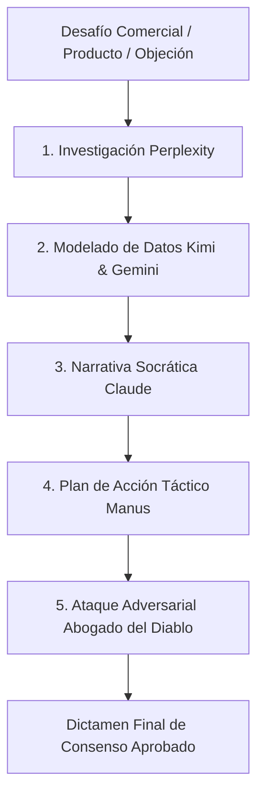

# 🏛️ CPS 5-LLM Council: Framework Universal de Deliberación Comercial B2B

## Visión General
El **CPS 5-LLM Council** es un framework agnóstico de orquestación agéntica multisistema diseñado por Antonio Gutiérrez para analizar, refinar y validar cualquier estrategia comercial B2B, propuesta de valor, pitch de ventas o arquitectura de producto SaaS en cualquier industria.

---

## 👥 Roles del Consejo Agéntico (Agnóstico de Industria)

1. **Claude (Estratega Principal & Copywriting Ejecutivo):** Formula la narrativa de alto impacto, adopta el tono CEO-to-CEO y aplica la metodología Pyramid Principle.
2. **Perplexity (Investigador de Mercado & Regulaciones en Tiempo Real):** Audita datos de mercado actualizados, competencia, normas vigentes y tendencias del sector objetivo.
3. **Kimi (Analista de Datos Masivos & Estructuras de Costos):** Modela unit economics, estructuras de TPV, comisiones, márgenes y proyecciones cuantitativas.
4. **Gemini (Arquitecto Técnico & Sistemas de Integración):** Define la factibilidad técnica, APIs, conectores ERP, seguridad de datos y stack tecnológico.
5. **Manus (Ejecutor Táctico "Sangre en el Campo"):** Convierte la estrategia en hojas de llamadas, scripts socráticos de prospección, secuencias de outreach y planes de sprint a 30 días.
6. **👹 El Abogado del Diablo (Evaluador Adversarial Zero-Assumption):** Somete cada punto a prueba de fricción, cuestiona supuestos no fundamentados y exige evidencias empíricas.

---

## 🔄 Flujo de Trabajo Universal



---

## 🛠️ Modos de Uso

### Modo 1: Validación de Pitch Comercial
```bash
python scripts/run_council_deliberation.py --topic "Propuesta de Valor SaaS" --industry "Fintech" --target "CFOs"
```

### Modo 2: Manejo Socrático de Objeciones
```bash
python scripts/run_council_deliberation.py --objection "Está muy caro comparado con X" --industry "Enterprise Software"
```
