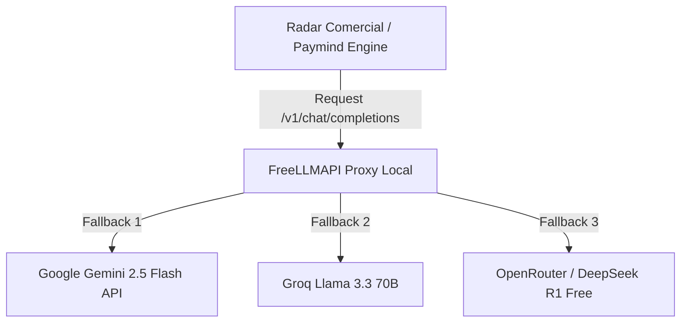

# ⚡ FreeLLMAPI (Proxy Unificado LLM con Zero Caídas)

Este skill documenta la configuración e integración de **FreeLLMAPI** (`tashfeenahmed/freellmapi`) para alimentar los motores de IA en **Radar Comercial** y **Paymind Growth Engine** a costo \$0 USD de infraestructura.

---

## 🎯 1. Arquitectura del Proxy

FreeLLMAPI actúa como una puerta de enlace (*gateway*) unificada `/v1/chat/completions` compatible con la SDK estándar de OpenAI:



---

## 🛠️ 2. Despliegue Rápido con Docker Compose

```yaml
version: '3.8'
services:
  freellmapi:
    image: tashfeenahmed/freellmapi:latest
    ports:
      - "8000:8000"
    environment:
      - GEMINI_API_KEY=${GEMINI_API_KEY}
      - GROQ_API_KEY=${GROQ_API_KEY}
      - OPENROUTER_API_KEY=${OPENROUTER_API_KEY}
      - SECRET_ENCRYPTION_KEY="radar_comercial_secure_vault"
```

---

## 💻 3. Uso en Python (Fallback Automático)

```python
import openai

client = openai.OpenAI(
    base_url="http://localhost:8000/v1",
    api_key="freellmapi-local-key"
)

response = client.chat.completions.create(
    model="auto-failover",
    messages=[
        {"role": "system", "content": "Eres un clasificador de ICP comercial B2B."},
        {"role": "user", "content": "Analizar la empresa Nómadas Capacitación."}
    ]
)

print(response.choices[0].message.content)
```
