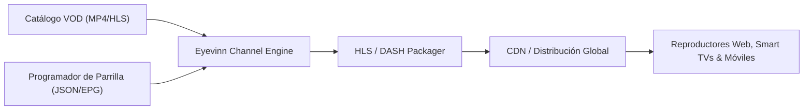

# 📺 Live Streaming & FAST Channel Engine Skill

Esta skill proporciona patrones de ingeniería para la creación, empaquetado y emisión de transmisiones de video en vivo continuas (canales lineales y FAST TV) a partir de contenido bajo demanda (VOD), así como streaming interactivo WebRTC de baja latencia.

Basado en las arquitecturas abiertas de [`Eyevinn/open-live`](https://github.com/Eyevinn/open-live) y [`katipally/openlive`](https://github.com/katipally/openlive).

---

## 🎯 Capacidades Principales

1. **Generación de Canales FAST (Free Ad-Supported TV):**
   * Creación de canales lineales 24/7 a partir de catálogos VOD con programación horaria (*Channel Engine*).
   * Inserción dinámica de publicidad (SSAI - *Server-Side Ad Insertion*) y bumpers promocionales.
   * Empaquetado automático en estándares **HLS** (m3u8) y **MPEG-DASH** (mpd).

2. **Transmisión Interactiva WebRTC:**
   * Streaming de cámara y audio en tiempo real punto a punto o uno a muchos con latencia sub-segundo (<500ms).
   * Interacción de usuarios y emisión simultánea en navegador web.

3. **Orquestación en Contenedores:**
   * Despliegues ligeros en Docker listos para CDN (Cloudflare Stream, AWS CloudFront, Fastly).

---

## 🏗️ Flujo de Arquitectura VOD-to-Live

---

## 🛠️ Buenas Prácticas de Despliegue

* **Alineación de Keyframes (GOP):** Mantener GOPs fijos de 2 segundos en los archivos fuente para transiciones fluidas entre segmentos sin cortes visibles.
* **Caché Eficiente en CDN:** Configurar `Cache-Control: max-age=1` para playlists dinámicas de directos (`live.m3u8`) y `max-age=86400` para segmentos inmutables (`.ts` / `.m4s`).
