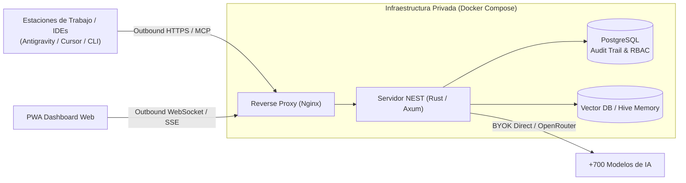

# 🐝 NEST Hub — Self-Hosted AI Workforce & Multi-Agent Governance Skill

Esta skill proporciona patrones de arquitectura, especificaciones de despliegue y directrices de integración para plataformas de IA auto-hospedadas (*self-hosted*), memoria organizacional compartida (*HIVE*), y gobernanza de agentes con soporte BYOK (*Bring Your Own Key*) para más de 700 modelos.

Basado en el diseño y arquitectura de [`contextzero/nest_hub`](https://github.com/contextzero/nest_hub).

---

## 🎯 Capacidades Principales

1. **Soberanía y Privacidad de Datos:**
   * Despliegue en infraestructura propia (Docker / VPS / On-Prem / Air-Gapped).
   * Cero telemetría externa hacia plataformas SaaS de terceros.
   * Registro completo de auditoría en PostgreSQL para cada prompt, respuesta y acción ejecutada.

2. **Enrutamiento de Modelos BYOK (Nexus):**
   * Conexión a +700 modelos vía OpenRouter, Fal AI, OpenAI, Anthropic y Google Gemini sin intermediarios ni márgenes de reventa.
   * Control granular de presupuestos, límites por usuario/proyecto y balanceo de carga.

3. **Memoria Organizacional Compartida (Hive):**
   * Grafo de conocimiento y base de memoria vectorial persistente compartida entre múltiples agentes de la célula.
   * Aprendizaje continuo acumulativo a partir de interacciones pasadas y proyectos terminados.

4. **Integración MCP y CLI (Annie):**
   * Conexión estandarizada mediante Model Context Protocol (MCP) para dotar a agentes locales (Claude Code, Cursor, Antigravity) de acceso al Hub centralizado.

---

## 🏗️ Arquitectura de Referencia (Docker Stack)



---

## 🚀 Despliegue Rápido y Comandos Clave

```bash
# 1. Clonar el stack
git clone https://github.com/contextzero/nest_hub.git
cd nest_hub

# 2. Configurar variables de entorno y secretos
cp .env.example .env
./setup.sh

# 3. Operación continua
docker compose up -d           # Iniciar servicios en background
docker compose logs -f         # Monitoreo de logs en tiempo real
docker compose pull && docker compose up -d # Actualización segura
```
