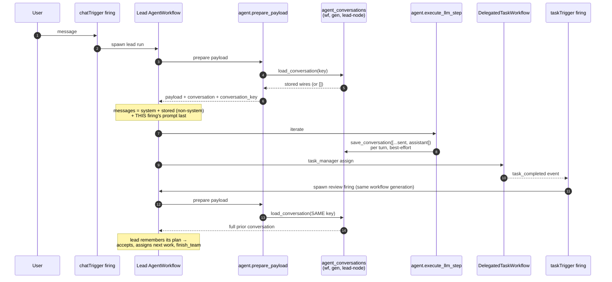

# Agent Context & Team Continuity Flow

Normative reference for how an agent's conversation survives across firings,
delegations, and rollovers — on both execution paths. Read this before
touching `services/agent_context/`, `nodes/context/`,
`services/cli_agent/context_bridge.py`, `agent.prepare_payload`,
`agent.execute_llm_step`, or the team-completion event chain. The invariants
at the bottom are the "do not break" contract; several were learned from a
production regression documented at the end.

Companion documents: [RFC-0002](../RFC-0002-AGENT-CONTEXT-AND-MEMORY.md)
(design rationale for Context vs Memory), [agent_teams.md](./agent_teams.md)
(team-lead contract), [TEMPORAL_ARCHITECTURE.md](./TEMPORAL_ARCHITECTURE.md)
(execution engine).

## The one-paragraph model

Context is **plain JSON messages**. One table, `agent_conversations`, keyed
by **`(workflow_id, generation, agent_node_id)`** → `messages` (a JSON list
of `MessageWire` dicts) + `updated_at`. A run **loads** the row at start and
**saves** the whole live message list back after every turn. Every firing of
an agent — chat messages AND taskTrigger completion reviews — continues the
one conversation; a workflow Reset admits a new generation, which is a new
key, which is a fresh conversation. The connected Context node is the
opt-in switch and the viewing panel, nothing more. This is the industry
pattern (LangGraph `thread_id`, OpenAI `conversation_id`, Claude Code
session files): a conversation id maps to a message list, and nothing else.

There are no threads, sessions, epochs, hash chains, checkpoints, blobs, or
operation ids. Memory (`simpleMemory`) is an ordinary tool — explicit
remember/recall — and plays no automatic part in continuity.

## The store (`services/agent_context/`)

| Function | Contract |
|---|---|
| `load_conversation(db, *, workflow_id, generation, agent_node_id) → List[Dict]` | The stored wires, `[]` when the key has no row. |
| `save_conversation(db, *, …, messages)` | Whole-list upsert under a per-key asyncio lock; stamps each message with a `ts` (UTC ISO — kept for the unchanged prefix, minted for the appended turn, view-only: `message_from_wire` ignores it); notifies listeners **after** the commit. |
| `clear_conversation(db, *, workflow_id, generation=None, agent_node_id=None) → int` | Deletes rows, optionally narrowed; returns the count. |
| `list_conversations(db, *, workflow_id)` | Panel metadata (`generation`, `agent_node_id`, `message_count`, `updated_at`), newest generation first. |

`listeners.py` carries `register_conversation_listener` /
`notify_conversation_saved`. The store never imports `nodes/`; the Context
plugin registers its `context.updated` broadcaster from
`nodes/context/__init__.py` — same layering as the other plugin registries.

## Full loop: chat → assign → child completes → review continues (Temporal path)



The review firing works **because the key is the same**: same workflow, same
generation, same lead agent node. No event routing, session lifting, or
thread resolution is involved — there is nothing to route.

## Message seeding: what a run's initial `messages` list is

```mermaid
flowchart TD
    R[AgentWorkflow run start] --> P{resume marker has<br/>carried transcript?}
    P -- "yes (continue-as-new)" --> C1["messages = carried transcript verbatim<br/>(exact live conversation, size-guarded ≤ 1 MB)"]
    P -- no --> Q{payload carries a stored<br/>conversation? (Context node,<br/>generation > 0, non-empty row)}
    Q -- yes --> C2["system (this firing's)<br/>+ stored wires minus system messages<br/>+ THIS firing's user prompt last"]
    Q -- no --> C3["bare build:<br/>system + memory markdown (legacy) + prompt"]
```

Precedence is exactly **carried transcript > stored conversation > bare
build** and is intentional:

- A rollover resumes the *same* run mid-flight — the live transcript is the
  truth and must win over any store read.
- A fresh firing with a Context node continues the *conversation* — the
  stored row is the truth.
- The bare build is the cold-start floor.

The carried transcript caps at ~1 MB serialized
(`_CAN_TRANSCRIPT_MAX_BYTES`) because Temporal's payload error limit is
2 MiB for the whole continue-as-new argument; over-cap degrades to the
opening prompt with a warning — never a failure.

## Compaction: one system prompt, summary as a user message

When the loop's token total crosses the threshold, `agent.compact_context`
summarizes the live transcript and the workflow swaps `messages` for
`[original system (verbatim), user("## Compacted conversation summary" +
summary + current request)]`. Two rules are load-bearing (locked by
`TestConversationIdentity::test_compaction_preserves_the_system_prompt_and_summary_survival`):

- **The system prompt is never modified or duplicated.** It is the agent's
  contract (personality + tool/delegation guidance) and must stay
  byte-stable — for provider prompt caching, and because the next firing's
  seeding drops stored system messages so policy changes take effect.
  Anything compaction stores under the system role therefore silently
  vanishes on the next firing; that is exactly how an earlier
  second-system-message design lost the summary on the next chat message
  while the noisy tool tail (non-system) outlived it.
- **The summary rides a user message**, so the compacted knowledge persists
  through seeding and crosses firings with the conversation it summarizes.

Prior tool calls/results are dropped from the live list at the swap — they
survive only inside the summary text. Tool messages that appear *after* the
summary in the panel are **new work the agent did post-compaction**, not
survivors (their `ts` stamps postdate the summary). Both the trigger
(`tokens >= threshold`, live message count) and the applied swap (before →
after counts, summary size) log at INFO, as does the activity (rendered
chars in, summary chars + summarizer usage out).

- **Load failures raise.** `agent.prepare_payload` raises
  `ApplicationError("ConversationLoadFailed")` (retryable) when the row
  cannot be read, and `ApplicationError("ConversationTooLarge")`
  (non-retryable, `_SEED_TRANSCRIPT_MAX_BYTES` = 1 MB — clear it from the
  Context panel) when it is oversized. Running on silently instead would
  burn tokens on an amnesiac prompt — the exact failure mode this design
  replaced.
- **Save failures warn and continue.** The save happens *after* the
  provider was called and billed, so raising there would fail a completed
  turn over a bookkeeping write. `_save_conversation`
  (`agent_activities.py`), the loop's `save_now()` (`agent_runtime.py`),
  and every specialized-provider `record_turn` call site swallow and log.

## Both execution paths, one contract

| Path | Load | Save |
|---|---|---|
| Temporal (`AgentWorkflow`) | `agent.prepare_payload` loads and returns `conversation` + `conversation_key` | `agent.execute_llm_step` saves `[...sent, assistant]` after each provider call |
| In-process (`services/ai.py`) | `_prepare_context` builds `_AgentContextRuntime{key, history, database}` | the loop's `conversation_saver=runtime.save` fires after each assistant append and after tool results |
| Specialized providers (claude_code / codex / rlm / vertex) | `SpecializedAgentContextBridge.resolve` loads; `augment_prompt` renders the transcript into the prompt | `record_turn(original_prompt, response)` appends and saves — always the **original** prompt, never the augmented one, or the save nests the transcript inside itself |

The opt-in gate is identical everywhere: the edge-walker descriptor's
`kind == "context"` plus an admitted `generation > 0` (manual canvas Runs
persist nothing by design — only Start admits a generation).

For claude, the session-pool key is the conversation key
(`(workflow_id, agent_node_id, generation)` — `bridge.pool_key`), so a
Reset's generation bump automatically fences warm subprocesses at `acquire`
time, and a same-generation panel Clear terminates them explicitly
(`ClaudeSessionPool.terminate_conversations`).

## The Context node and panel

`nodes/context/` owns the opt-in descriptor (`_descriptor.py`), two WS
handlers (`get_agent_context` returns the **live generation only** —
`{conversations, generation, agent_node_id, updated_at, message_count,
messages}`, with an `agent_node_id` selector for nodes shared by several
agents; `clear_agent_context` deletes rows and fences warm claude
processes), and one CloudEvents broadcast (`context.updated`, fired from the
registered save listener; payload is identity + count only — the panel
refetches through the authorized handler). The node declares **no
parameters**; the connection is the whole configuration.

The panel ([`ContextPanel.tsx`](../client/src/components/parameterPanel/ContextPanel.tsx))
renders role-tinted message cards with per-message `ts` timestamps, routes
JSON-shaped payloads (tool calls, tool results) through the themed JSON
tree on the per-theme `--code-*` surface, and offers a **Raw** tab showing
the stored wires verbatim. It declares `refetchOnMount: 'always'` because
the app's global `refetchOnMount: false` default would render stale cache
when the panel opens after a run that mutated the conversation while no
observer was mounted.

**Reset wipes.** `AgentContextNode.reset_execution_state` clears every
stored conversation for the workflow, terminates warm claude subprocesses
holding the wiped transcript, and broadcasts `context.updated` so open
panels refresh. The generation bump alone is NOT enough: the panel shows
the newest STORED generation, so surviving rows would keep rendering the
pre-Reset conversation as the live context and Reset would look like a
no-op. A plain Stop → Start (new generation without Reset) leaves prior
rows in the store as inert history — deliberately **not browsable from
the panel**, which shows only the agent's current context — until the
workflow is deleted (the archive-outbox drain in
`services/workflow_storage/handlers.py`) or Reset runs.

## Invariants (do not break)

| # | Invariant | Why |
|---|---|---|
| 1 | The store observes; it never steers. Requests are always built from `messages`; `conversation_key` only says where to save. | The original `context_ref` regression made attaching a Context node change what the agent sent. |
| 2 | One key per agent per generation: `(workflow_id, generation, agent_node_id)`. Every firing — chat or task review — continues that one conversation. | Per-firing/per-session keys are how the lead came back amnesiac (`messages=2`). |
| 3 | Seeding precedence: carried transcript > stored conversation > bare build. | Rollover mid-run truth beats the store; the store beats cold start. |
| 4 | Load failures are LOUD (`ConversationLoadFailed` / `ConversationTooLarge`); save failures are best-effort. | Never burn tokens on an amnesiac prompt; never fail a billed turn over bookkeeping. |
| 5 | Save the exact sent list, after the provider call. Nothing writes to the store before a request exists. | The journal's `prepare_context` wrote fabricated requests assembled from configuration. |
| 6 | Reset = new generation = new key, AND the Context node's reset hook clears the workflow's stored rows. | The panel shows the newest stored generation, so surviving rows make Reset look like a no-op. |
| 7 | `input-memory` is retired; the conversation store is the continuity carrier. Do not resurrect markdown seeding. | `normalize_workflow_graph` migrates it away and the validator rejects it; two carriers would drift. |
| 8 | Specialized bridges record the ORIGINAL prompt, never the augmented one. | Recording the rendered transcript nests the conversation inside itself and grows without bound. |
| 9 | The store never imports `nodes/`; the plugin registers its broadcaster via `register_conversation_listener`, and a listener failure can never fail a save. | Same layering rule as every plugin registry; a UI notification must not break execution. |

## How this broke (August 2026 regression), and why the journal went away

Symptom: a team lead re-invoked by a `taskTrigger` completion started at
`messages=2`, accepted the task, and returned — "forgot its plan" — after a
Context node was added.

The original carrier was an append-only **journal** (7 tables: threads,
hash-chained events, checkpoints, blobs, provider bindings, epochs) with
per-firing operation ids and session/task/execution thread resolution. It
failed twice in the same direction: the Temporal path was write-only (fresh
firings never read the journal back), and completion firings resolved a
different thread than the chat that started the work. Both were patched —
and the patched system still carried thread routing, epoch fencing, and
reconstruction machinery whose only job was to approximate "one agent, one
conversation".

The replacement makes that property structural instead of routed: the
conversation key **is** workflow + generation + agent node, so a firing
cannot land in the wrong conversation because there is no resolution step
to get wrong. When an agent "ignores" its guidance, check what its
`messages` list actually contained first.
