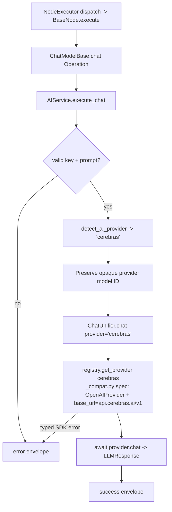

# Cerebras Chat Model (`cerebrasChatModel`)

| Field | Value |
|------|-------|
| **Category** | ai_chat_models |
| **Backend handler** | [`server/nodes/model/cerebras_chat_model/__init__.py`](../../../server/nodes/model/cerebras_chat_model/__init__.py) (dispatch via `BaseNode.execute()` -> `@Operation("chat")` in [`server/nodes/model/_base.py`](../../../server/nodes/model/_base.py)) |
| **AI service** | [`server/services/ai.py::AIService.execute_chat`](../../../server/services/ai.py) |
| **Tests** | [`server/tests/nodes/test_ai_chat_models.py`](../../../server/tests/nodes/test_ai_chat_models.py) |
| **Skill (if any)** | n/a |
| **Dual-purpose tool** | no (group `('model',)`) |

## Purpose

Ultra-fast inference on Cerebras' custom AI hardware. The current curated
models are GPT-OSS-120b plus preview Z.ai GLM 4.7 and Gemma 4 tiers. The
`ChatModelBase.chat` operation calls
`AIService.execute_chat`, which routes through `ChatUnifier`. Like Groq,
Cerebras is one of the eight OpenAI-compatible providers registered in
`providers/_compat.py`; bare chat and current agent executions share this
native provider path.

## Inputs (handles)

| Handle | Connection type | Required | Purpose |
|--------|-----------------|----------|---------|
| `input-main` | main | no | Upstream data; not consumed directly |

## Parameters

| Name | Type | Default | Required | displayOptions.show | Description |
|------|------|---------|----------|---------------------|-------------|
| `prompt` | string | `""` | yes | - | User message |
| `system_prompt` | string | `""` | no | - | System prompt |
| `model` | string | `""` (injected) | no | - | e.g. `llama3.1-8b`, `gpt-oss-120b`, `qwen-3-235b-a22b` |
| `temperature` | number\|null | `null` | no | - | Narrower range than OpenAI (0-1.5 rather than 0-2) |
| `max_tokens` | number\|null | `null` (up to 8K) | no | - | 1-200000 |
| `top_p` | number\|null | `1.0` | no | - | |
| `thinking_enabled` | boolean | `false` | no | - | Only Qwen-3-235b supports format-based reasoning |
| `thinking_budget` | number\|null | `2048` | no | `thinking_enabled=[true]` | 1024-16000 (Cerebras Qwen budget) |
| `reasoning_format` | enum | `parsed` | no | - | `parsed` / `hidden` - same semantics as Groq Qwen (inherited base field) |
| `api_key` | string\|null | `null` (injected) | no | - | `auth_service.get_api_key('cerebras', 'default')` |

(Field names are snake_case on `CerebrasChatModelParams`; unknown keys ignored.)

## Outputs (handles)

| Handle | Shape | Description |
|--------|-------|-------------|
| `output-model` | object | Model output; standard envelope payload |

### Output payload

```ts
{
  response: string;
  thinking: string | null;
  thinking_enabled: boolean;
  model: string;
  provider: 'cerebras';
  finish_reason: string;
  timestamp: string;
  input: { prompt: string; system_prompt: string };
}
```

## Logic Flow



## Decision Logic

- **Validation**: missing api_key / empty prompt -> error envelope.
- **Provider routing**: `detect_ai_provider` matches `'cerebras' in node_type.lower()` **before** the groq branch, so routing is unambiguous.
- **Native OpenAI-compatible path**: `ChatUnifier` resolves the `cerebras`
  spec registered in `providers/_compat.py` (reuses `OpenAIProvider` with the
  Cerebras `base_url`) for both chat and agent requests.
- **Reasoning**: the curated reasoning-capable model is `zai-glm-4.7`; other current Cerebras models ignore the shared thinking controls.
- **Temperature range**: narrower (0-1.5 clamp) than OpenAI/Groq. `_resolve_temperature` applies the clamp.

## Side Effects

- **Database writes**: none on bare chat path.
- **Broadcasts**: none.
- **External API calls**: `POST https://api.cerebras.ai/v1/chat/completions` via the native `openai` SDK with `base_url` override.
- **File I/O**: none.
- **Subprocess**: none.

## External Dependencies

- **Credentials**: `auth_service.get_api_key('cerebras', 'default')` plus optional `cerebras_proxy`.
- **Services**: `ChatUnifier` + `OpenAIProvider` with the Cerebras `base_url`.
- **Python packages**: `openai`.
- **Environment variables**: none.

## Edge cases & known limits

- **Temperature capped at 1.5**, not 2.
- **Reasoning only on the configured GLM preview tier**.
- **Output ceiling**: current curated Cerebras models allow up to 40,960 output tokens; unknown models use the configured 8K fallback.
- **Error boundary**: typed OpenAI SDK failures become user-safe `NodeUserError` values in `ChatUnifier` and are re-raised to `BaseNode.execute()`, which produces the standard failure envelope. Unexpected failures are logged and returned by `execute_chat`.

## Related

- **Peer nodes**: see the other chat-model docs in this folder.
- **Architecture docs**: [Native LLM SDK](../../native_llm_sdk.md).
