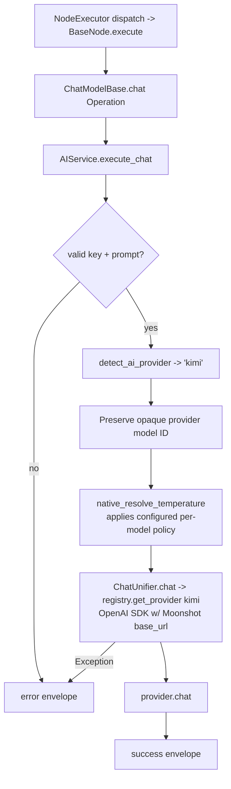

# Kimi Chat Model (`kimiChatModel`)

| Field | Value |
|------|-------|
| **Category** | ai_chat_models |
| **Backend handler** | [`server/nodes/model/kimi_chat_model/__init__.py`](../../../server/nodes/model/kimi_chat_model/__init__.py) (dispatch via `BaseNode.execute()` -> `@Operation("chat")` in [`server/nodes/model/_base.py`](../../../server/nodes/model/_base.py)) |
| **AI service** | [`server/services/ai.py::AIService.execute_chat`](../../../server/services/ai.py) |
| **Tests** | [`server/tests/nodes/test_ai_chat_models.py`](../../../server/tests/nodes/test_ai_chat_models.py) |
| **Skill (if any)** | n/a |
| **Dual-purpose tool** | no (group `('model',)`) |

## Purpose

Kimi models by Moonshot AI. `kimi-k3` is the current default with a
1,048,576-token context window and a 131,072-token output ceiling;
`kimi-k2.6`, `kimi-k2.5`, and `kimi-k2.7-code` remain available as 262K
tiers. The node uses Moonshot's OpenAI-compatible endpoint through the native
provider layer and the shared `ChatModelParams`.

## Inputs (handles)

| Handle | Connection type | Required | Purpose |
|--------|-----------------|----------|---------|
| `input-main` | main | no | Upstream data; not consumed directly |

## Parameters

| Name | Type | Default | Required | displayOptions.show | Description |
|------|------|---------|----------|---------------------|-------------|
| `prompt` | string | `""` | yes | - | User message |
| `system_prompt` | string | `""` | no | - | System prompt |
| `model` | string | `""` (injected) | no | - | `kimi-k3` default; `kimi-k2.6`, `kimi-k2.5`, and `kimi-k2.7-code` also supported |
| `temperature` | number\|null | `null` | no | - | K2.5/K2.6/K2.7 Code force 0.6; K3 uses the supplied/default value clamped to 0-1 |
| `max_tokens` | number\|null | `null` (model ceiling) | no | - | Up to 131,072 for K3; lower model-specific ceilings for K2 tiers |
| `top_p` | number\|null | `1.0` | no | - | |
| `thinking_enabled` | boolean | `false` (Params default) | no | - | When false/unset, the native provider explicitly disables K2.5/K2.6/K2.7 thinking defaults |
| `api_key` | string\|null | `null` (injected) | no | - | `auth_service.get_api_key('kimi', 'default')` |

(Kimi uses the shared `ChatModelParams` unchanged; field names are snake_case, unknown keys ignored.)

## Outputs (handles)

| Handle | Shape | Description |
|--------|-------|-------------|
| `output-model` | object | Model output; standard envelope payload |

### Output payload

```ts
{
  response: string;
  thinking: string | null;
  thinking_enabled: boolean;
  model: string;
  provider: 'kimi';
  finish_reason: string;
  timestamp: string;
  input: { prompt: string; system_prompt: string };
}
```

## Logic Flow



## Decision Logic

- **Validation**: missing api_key / empty prompt -> error envelope.
- **Provider routing**: `detect_ai_provider` matches `'kimi' in node_type.lower()`. Ordering guarantees it lands in the kimi lane before groq / openrouter / anthropic / gemini.
- **Temperature policy**: K2.5, K2.6, and K2.7 Code are fixed at 0.6 by configuration. K3 uses the supplied/default value clamped to Kimi's 0-1 range.
- **Thinking defaults**: Moonshot's K2.5/K2.6/K2.7 models can default to thinking, so the native provider explicitly sends `thinking={"type":"disabled"}` unless the request enables thinking. This keeps ordinary chat and tool-call parsing deterministic.
- **Native path**: uses the OpenAI SDK with Moonshot base_url from `llm_defaults.json`.
- **Model ID handling**: only the UI-only `[FREE] ` decoration is stripped. The remaining model ID is preserved.

## Side Effects

- **Database writes**: none on bare chat path.
- **Broadcasts**: none.
- **External API calls**: `POST https://api.moonshot.ai/v1/chat/completions` (via OpenAI SDK with override).
- **File I/O**: none.
- **Subprocess**: none.

## External Dependencies

- **Credentials**: `auth_service.get_api_key('kimi', 'default')` plus optional `kimi_proxy`.
- **Services**: `services/llm/providers/openai.py` (reused).
- **Python packages**: `openai`.
- **Environment variables**: none.

## Edge cases & known limits

- **K2 temperature is non-configurable**: any user-supplied value is overridden to 0.6 for the configured K2 tiers; this does not apply to K3.
- **Default application behavior is thinking off** for K2.5/K2.6/K2.7 unless the request explicitly enables it.
- **K3 capacity**: 1,048,576-token context and 131,072-token output. K2 tiers use 262,144-token context with model-specific 32K or 96K output ceilings.
- **Error boundary**: typed OpenAI SDK failures become user-safe `NodeUserError` values in `ChatUnifier` and are re-raised to `BaseNode.execute()`, which produces the standard failure envelope. Unexpected failures are logged and returned by `execute_chat`.

## Related

- **Peer nodes**: see the other chat-model docs in this folder.
- **Architecture docs**: [Native LLM SDK](../../native_llm_sdk.md).
