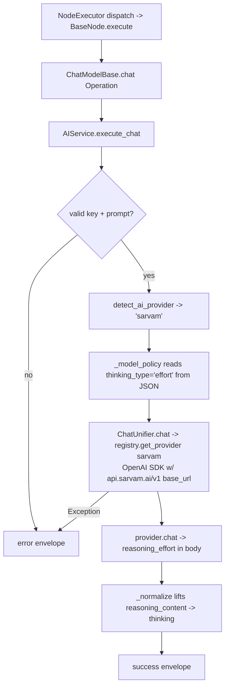

# Sarvam AI Chat Model (`sarvamChatModel`)

| Field | Value |
|------|-------|
| **Category** | ai_chat_models |
| **Backend handler** | [`server/nodes/model/sarvam_chat_model/__init__.py`](../../../server/nodes/model/sarvam_chat_model/__init__.py) (dispatch via `BaseNode.execute()` -> `@Operation("chat")` in [`server/nodes/model/_base.py`](../../../server/nodes/model/_base.py)) |
| **AI service** | [`server/services/ai.py::AIService.execute_chat`](../../../server/services/ai.py) |
| **Tests** | [`server/tests/nodes/test_ai_chat_models.py`](../../../server/tests/nodes/test_ai_chat_models.py), [`server/tests/llm/test_model_listing_fallback.py`](../../../server/tests/llm/test_model_listing_fallback.py) |
| **Skill (if any)** | n/a |
| **Dual-purpose tool** | no (group `('model',)`) |

## Purpose

Sarvam AI's Indic-first LLMs — `sarvam-105b` (flagship, 128K context) and
`sarvam-30b` (64K) — covering the 10 most-spoken Indian languages plus English
in native script, romanised and code-mixed input. Registered as an
OpenAI-compatible provider (one `_COMPAT_PROVIDERS` entry, no provider
subclass); reasoning is on by default server-side.

## Inputs (handles)

| Handle | Connection type | Required | Purpose |
|--------|-----------------|----------|---------|
| `input-main` | main | no | Upstream data; not consumed directly |

## Parameters

| Name | Type | Default | Required | displayOptions.show | Description |
|------|------|---------|----------|---------------------|-------------|
| `prompt` | string | `""` | yes | - | User message |
| `system_prompt` | string | `""` | no | - | System prompt |
| `model` | string | `""` (injected) | no | - | `sarvam-105b` / `sarvam-30b` |
| `temperature` | number\|null | `null` | no | - | 0-2. Sarvam's own default is 0.5 with reasoning on, 0.2 without |
| `max_tokens` | number\|null | `null` | no | - | Defaults to the `llm_defaults.json` value (4096 — the Starter-tier cap). Raising it here does nothing unless the JSON is raised too |
| `top_p` | number\|null | `1.0` | no | - | |
| `frequency_penalty` | number\|null | `0.0` | no | - | -2.0 to 2.0 |
| `presence_penalty` | number\|null | `0.0` | no | - | -2.0 to 2.0 |
| `response_format` | enum\|null | `"text"` | no | - | `text` / `json_object` |
| `thinking_enabled` | boolean | `false` | no | - | Only decides whether we override Sarvam's default effort |
| `reasoning_effort` | enum\|null | `"medium"` | no | `thinking_enabled: [true]` | `low` / `medium` / `high` |
| `api_key` | string\|null | `null` (injected) | no | - | `auth_service.get_api_key('sarvam', 'default')` |

(Field names are snake_case on `SarvamChatModelParams`; unknown keys ignored.)

## Outputs (handles)

| Handle | Shape | Description |
|--------|-------|-------------|
| `output-model` | object | Model output; standard envelope payload |

### Output payload

```ts
{
  response: string;
  thinking: string | null;   // from message.reasoning_content
  thinking_enabled: boolean;
  model: string;
  provider: 'sarvam';
  finish_reason: string;
  timestamp: string;
  input: { prompt: string; system_prompt: string };
}
```

## Logic Flow



## Decision Logic

- **Validation**: missing api_key / empty prompt -> error envelope.
- **Provider routing**: `detect_ai_provider` matches `'sarvam' in node_type.lower()`; the token collides with no other branch.
- **Thinking**: `thinking_type: "effort"` in `llm_defaults.json` drives `params["reasoning_effort"]` — no Python branch. `thinking_enabled=false` sends *no* effort field, so Sarvam applies its own default (reasoning on, medium).
- **Temperature stays allowed while reasoning**: `reasoning_models` is deliberately empty for sarvam, so `_model_policy` does not set `temperature_allowed=False` or pin 1.0.
- **No `thinking_default_on`**: that key would emit Moonshot's proprietary `extra_body.thinking = {"type": "disabled"}`, which Sarvam never defined.
- **Model listing**: the provider declares `supports_model_listing: false`; `fetch_models` returns the curated list and probes the key with a one-token completion (see edge cases).

## Side Effects

- **Database writes**: none on the bare chat path.
- **Broadcasts**: none.
- **External API calls**: `POST https://api.sarvam.ai/v1/chat/completions` (via the OpenAI SDK with an overridden base URL).
- **File I/O**: none.
- **Subprocess**: none.

## External Dependencies

- **Credentials**: `auth_service.get_api_key('sarvam', 'default')` plus optional `sarvam_proxy`. The same key authenticates the five `nodes/sarvam/` REST nodes.
- **Services**: `services/llm/providers/openai.py` (reused with Sarvam's base_url), registered in `providers/_compat.py`.
- **Python packages**: `openai`.
- **Environment variables**: none.

## Edge cases & known limits

- **No `/v1/models` endpoint.** Verified against <https://docs.sarvam.ai/openapi.json> (25 paths, none for model listing). Unhandled, the 404 surfaces as an `openai.OpenAIError` -> `NodeUserError`, which `AIService.fetch_models` re-raises *before* its curated fallback — breaking credential validation and the model dropdown for a valid key. The `supports_model_listing: false` flag routes around this generically.
- **The output cap is a subscription tier, not a model limit.** Sarvam allows 4096 output tokens on Starter, 16384 / 8192 on Pro and 128000 / 64000 on Business, and 400s on anything above your tier ("max_tokens (65536) exceeds the maximum allowed for sarvam-105b for your subscription tier (starter): 4096"). `resolve_max_tokens` uses the `llm_defaults.json` number as both the unset default and the clamp ceiling, so it ships as the Starter cap (4096) — the only value that works on every account. Pro/Business users must raise it in the JSON; raising `max_tokens` on the node alone is clamped straight back down.
- **`popular_models` is `[]`** per the >=1M-context policy (Sarvam maxes at 131072); the dropdown falls through to the `max_output_tokens` keys, so both models still appear.
- **`sarvam-m` is deprecated** and removed from the API — deliberately absent from the config.
- **`wiki_grounding` is not exposed.** Sarvam accepts it, but an extra `Params` field cannot reach the API today: `execute_chat` reads a closed key set off `flattened`. See [Sarvam AI Service](../../sarvam_service.md#known-limits).
- **Error boundary**: typed OpenAI SDK failures become user-safe `NodeUserError` values in `ChatUnifier` and are re-raised to `BaseNode.execute()`.

## Related

- **Peer nodes**: see the other chat-model docs in this folder.
- **Sibling plugins**: the five Sarvam REST nodes in [`language/`](../language/) share this node's credential.
- **Architecture docs**: [Native LLM SDK](../../native_llm_sdk.md), [Sarvam AI Service](../../sarvam_service.md).
