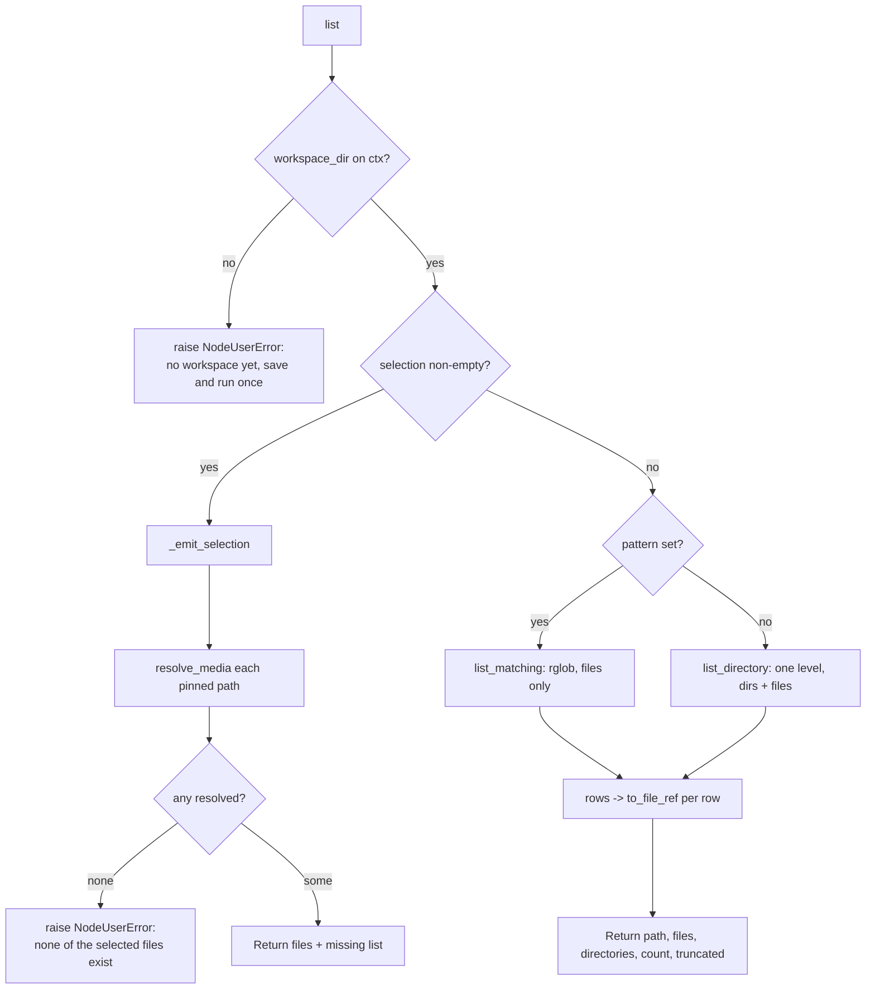

# Gallery (`gallery`)

| Field | Value |
|------|-------|
| **Category** | code_fs_process / filesystem |
| **Backend handler** | [`server/nodes/filesystem/gallery/__init__.py::GalleryNode.list_files`](../../../server/nodes/filesystem/gallery/__init__.py) (dispatched via `BaseNode.execute()` + `@Operation("list")`) |
| **Backend** | Native `WorkspaceBackend` (`ls_info`, `glob_info`) in [`server/nodes/filesystem/_backend.py`](../../../server/nodes/filesystem/_backend.py), wrapped by [`_service.py`](../../../server/nodes/filesystem/gallery/_service.py) |
| **WS handler** | `list_workspace_files` in [`_handlers.py`](../../../server/nodes/filesystem/gallery/_handlers.py) (`@ws_response`, self-registered from `__init__.py`) |
| **Tests** | [`server/tests/nodes/test_gallery.py`](../../../server/tests/nodes/test_gallery.py) |
| **Skill (if any)** | none |
| **Dual-purpose tool** | **no** — `usable_as_tool = False` is deliberate (see Purpose) |

## Purpose

Browse the per-workflow workspace from the editor. The point is the panel: it
lists what a workflow has actually produced and lets a file be dragged straight
onto another node's parameter. Before this, using a produced file meant already
knowing its path and typing it by hand.

Running the node is not a no-op — it emits the listing as `FileRef` rows, so
downstream nodes can consume workspace files inside a workflow, not just in the
editor.

**Deliberately not `usable_as_tool`.** `fsSearch` (ls/glob/grep) and `fileModify`
(write/edit) already cover what an agent needs, and this node carries destructive
operations; shipping an editor panel must not hand every agent a delete tool as a
side effect. If agent-facing delete is ever wanted it belongs on `fileModify`,
where the tool description can be written carefully.

## Inputs (handles)

| Handle | Connection type | Required | Purpose |
|--------|-----------------|----------|---------|
| `input-main` | main | no | Not consumed |

## Parameters

| Name | Type | Default | Required | displayOptions.show | Description |
|------|------|---------|----------|---------------------|-------------|
| `path` | string | `""` | no | - | Workspace-relative directory to list. Empty = workspace root |
| `pattern` | string | `""` | no | - | Optional glob (e.g. `*.wav`). Set = recursive search under `path` |
| `selection` | string[] | `[]` | no | - | Specific workspace-relative files to emit, pinned in the panel |
| `include_dirs` | boolean | `false` | no | - | Include directories in the output as well as files |
| `limit` | integer (`ge=1`, `le=1000`) | `200` | no | - | Row cap |

`GalleryParams` uses `extra="ignore"`.

**The panel writes these back.** Navigating a folder writes `path`; ticking a row
writes `selection`. That coupling is the design: what you browse is what the node
lists when it runs, so the panel cannot drift from the node. Note the panel's
search box is *not* one of these — it is transient view state, sent as `search`
on the WS request only.

## Outputs (handles)

| Handle | Shape | Description |
|--------|-------|-------------|
| `output-main` | object | Standard envelope payload |

### Output payload

```ts
{
  path: string;            // the directory that was listed
  files: FileRef[];        // serialized FileRef rows, always kind:"file"
  directories: string[];   // [] unless include_dirs
  count: number;           // == files.length (capped, NOT the untruncated total)
  truncated: boolean;
  missing?: string[];      // selection mode only — pinned files that have gone
}
```

## Logic Flow



## Decision Logic

- **Three mutually exclusive branches**, checked in this order: `selection`
  wins over `pattern`, which wins over a plain directory listing.
- **`_emit_selection` is partial-failure tolerant.** A pinned file that no
  longer resolves is reported in `missing[]` rather than failing the node — the
  node that writes it may simply not have run yet in this execution. Only an
  *entirely* missing selection raises.
- **`list_directory` never recurses.** `glob_info` uses `rglob`, so a `*`
  pattern would walk the whole tree unbounded; directory-at-a-time is what a
  browser needs anyway.
- **`list_matching` is files-only** (`glob_info` filters directories out), and
  omits `parent` / `crumbs` / `workspace_exists` / `path_exists`. The two
  branches genuinely return different key sets — discriminate on `pattern`.
- **Caps**: `max(1, min(limit, WORKSPACE_LIST_LIMIT=1000))`, default 500 on the
  WS path. `count == len(entries)`; the untruncated total is never sent.
- **Sort is `(not is_dir, name.lower())`** — directories first. Not cosmetic:
  it means truncating at the cap can never strip navigation out of the response.

## Side Effects

- **Database writes**: none. (`resolve_workspace_root` *reads* the workflow row
  to translate id → slug.)
- **Broadcasts**: none.
- **External API calls**: none.
- **File I/O**: directory enumeration under the workspace root, via
  `asyncio.to_thread` (`iterdir` on a large directory blocks, and the WS handler
  runs on the shared event loop). `stat()` per entry for size/mtime.
- **Subprocess**: none.

## External Dependencies

- **Python packages**: standard library only (`mimetypes`, `pathlib`, `asyncio`).
- **Environment variables**: `WORKSPACE_BASE_DIR`.

## Edge cases & known limits

- **Rows are self-sufficient by contract.** Each carries a finished `ref`
  (serialized `FileRef`, `null` for directories) and a `preview` verdict from
  [`services/media/preview.py`](../../../server/services/media/preview.py). The
  client re-derives neither — for `preview` that would be a second copy of a
  *security* decision, and the two must agree or the panel offers a preview the
  route refuses to serve inline.
- **`kind` is always `"file"`, even for a `.wav`.** `kind="audio"` asserts
  `inspect_audio` probed the container; this path only guessed a MIME type from
  the extension, and a fabricated duration would mis-bill a per-second provider
  downstream.
- **Paths are workspace-relative with no leading slash.** `_file_info` emits
  `/audio/x.wav`; `_relative()` strips it here because
  `PurePosixPath('/audio/x.wav').is_absolute()` is `True` while the Windows
  flavour is `False` — so a leading slash resolves fine on a Windows dev box and
  raises "outside this workflow's workspace" on Linux. A production-only bug
  class. `_file_info` is deliberately left alone: `fsSearch` output and its
  LLM-facing prompt depend on the current shape.
- **`/etc` and `C:/Windows` are not escapes.** A leading slash is the *virtual*
  root and a drive prefix is stripped by `_validate_virtual_path`; both resolve
  inside the workspace. Real traversal (`..`, `~`) does raise. Test containment,
  not rejection.
- **`workspace_exists` vs `path_exists` must be probed before `get_backend`,**
  which mkdirs its root — probe after and the answer is always `True`, so the
  panel could never distinguish "no workspace yet" from "empty folder".
  `ls_info` returns `[]` for both.
- **The cap bounds the payload, not the walk.** `ls_info` materialises the
  directory before slicing. Fine until ~10k entries in one directory.
- **Listing is a WS command, content is HTTP.** `list_workspace_files` is the
  listing channel; `GET /api/workspace/{id}/files/{path}` stays the content
  channel (preview, download, Range). The consumer already holds an
  authenticated socket with request correlation, so a second HTTP listing
  surface would mean a second auth path and a second error envelope for no gain.
- **Reads may fall back to the anonymous `"default"` workspace.** The handler
  calls `resolve_workspace_root(..., allow_default=True)`. Any future *mutating*
  handler must pass `allow_default=False`, or an unresolvable id (stale tab,
  workflow deleted in another window) silently operates on a different context's
  files.
- **No mutations yet.** mkdir / rename / move / delete are not implemented.
