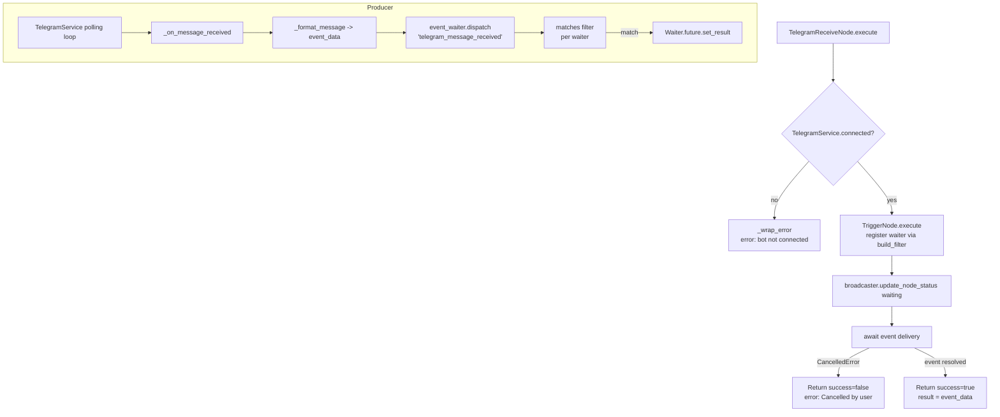

# Telegram Receive (`telegramReceive`)

| Field | Value |
|------|-------|
| **Category** | social / trigger |
| **Backend handler** | [`server/nodes/telegram/telegram_receive.py`](../../../server/nodes/telegram/telegram_receive.py) (`TelegramReceiveNode`, a `TriggerNode` with `event_type = "telegram_message_received"`); filter via `build_filter` -> [`build_telegram_filter`](../../../server/nodes/telegram/_filters.py) |
| **Tests** | [`server/tests/nodes/test_telegram_social.py`](../../../server/tests/nodes/test_telegram_social.py) (node level), [`test_telegram_service.py`](../../../server/tests/nodes/test_telegram_service.py) (service level: `_format_message` per content type) |
| **Skill (if any)** | none |
| **Dual-purpose tool** | no (trigger only) |

## Purpose

Wait for an incoming Telegram message and emit it as the workflow trigger
event. `TelegramReceiveNode` subclasses `TriggerNode`; its `execute` override
first refuses to register if the bot is not connected, then defers to
`TriggerNode.execute`. The Telegram-specific `build_filter` pre-compiles a
`matches()` closure (via `build_telegram_filter`, which lives in this plugin
folder's [`_filters.py`](../../../server/nodes/telegram/_filters.py) — Wave
11.F moved it out of `services/event_waiter.py`) from the node parameters.
In practice `__init__.py` pre-registers the builder, so `build_filter` is only
reached for types absent from `FILTER_BUILDERS`; its import previously still
pointed at the old `services.event_waiter` location and would have raised
`ImportError` had that path ever been taken. Events are produced by the `TelegramService` long-polling loop
inside `_on_message_received`. In controlled deployment mode, the trigger
definition and queued CloudEvents live in `WorkflowControlWorkflow`; the
controller filters/deduplicates the stream and starts only actual graph runs.
`TriggerListenerWorkflow` remains a legacy compatibility path.

## Inputs (handles)

Trigger node - no inputs.

## Parameters

All field names are snake_case (no camelCase aliases on the Pydantic model).

| Name | Type | Default | Required | displayOptions.show | Description |
|------|------|---------|----------|---------------------|-------------|
| `content_type_filter` | options | `all` | no | - | One of `all`/`media`/`text`/`photo`/`video`/`audio`/`voice`/`animation`/`video_note`/`document`/`sticker`/`location`/`contact`/`poll`. `media` matches any message carrying a downloadable file (the eight media kinds), so a workflow can react to "any attachment" without enumerating types |
| `sender_filter` | options | `all` | no | - | `all`/`self`/`private`/`group`/`supergroup`/`channel`/`specific_chat`/`specific_user`/`keywords` |
| `chat_id` | string | `""` | yes when `sender_filter=specific_chat` | `sender_filter: ['specific_chat']` | Numeric chat id or `@username` |
| `from_user` | string | `""` | yes when `sender_filter=specific_user` | `sender_filter: ['specific_user']` | Numeric user id |
| `keywords` | string | `""` | yes when `sender_filter=keywords` | `sender_filter: ['keywords']` | Comma-separated, matched case-insensitively |
| `ignore_bots` | boolean | `true` | no | shown for every `sender_filter` except `self` | Skip messages where `is_bot=True` (ignored when `sender_filter=self`) |

Legacy alias: `chatTypeFilter` is still read by `build_telegram_filter` when
`sender_filter` is absent and reconstructs the new-style value.

## Outputs (handles)

| Handle | Shape | Description |
|--------|-------|-------------|
| `output-main` | object | Formatted event from `TelegramService._format_message` |

### Output payload

```ts
{
  message_id: number;
  chat_id: number;
  chat_type: 'private' | 'group' | 'supergroup' | 'channel';
  chat_title: string | null;
  from_id: number | null;
  from_username: string | null;
  from_first_name: string | null;
  from_last_name: string | null;
  is_bot: boolean;
  text: string;                 // msg.text or msg.caption or '' (unchanged)
  caption: string;              // the caption alone, '' when there is none
  content_type: 'text' | 'photo' | 'video' | 'audio' | 'voice' | 'animation'
              | 'video_note' | 'document' | 'sticker' | 'location'
              | 'contact' | 'poll';
  date: string;                 // ISO timestamp
  reply_to_message_id: number | null;
  media_group_id: string | null;// shared by messages sent as one album
  has_media: boolean;

  // Normalized view — READ THIS, not the per-type blocks below.
  media: {
    kind: 'photo'|'video'|'audio'|'voice'|'animation'|'video_note'|'sticker'|'document';
    file_id: string;            // re-send via telegramSend without re-uploading
    file_unique_id: string;     // stable across bots — a dedup key
    mime_type: string;          // synthesised when Telegram omits it
    file_name: string;          // synthesised when Telegram omits it
    file_size: number | null;
    duration: number | null;
    width: number | null;
    height: number | null;
    caption: string;
    file_path: null;            // set only after an explicit download
    downloaded: false;
    download_error?: string;
  } | null;

  // Bounded summary of the quoted message, so an agent asked to
  // "transcribe this" can see what "this" refers to.
  reply_to?: {
    message_id: number;
    content_type: string;
    text: string;               // capped at 500 chars
    media?: { kind; file_id; mime_type };
  };

  // Telegram-native detail blocks, one populated per message.
  photo?:      { file_id; file_unique_id; width; height; file_size };
  video?:      { file_id; file_unique_id; width; height; duration; file_name; mime_type; file_size };
  animation?:  { file_id; file_unique_id; width; height; duration; file_name; mime_type; file_size };
  video_note?: { file_id; file_unique_id; length; duration; file_size };
  audio?:      { file_id; file_unique_id; duration; performer; title; file_name; mime_type; file_size };
  voice?:      { file_id; file_unique_id; duration; mime_type; file_size };
  sticker?:    { file_id; file_unique_id; width; height; emoji; set_name; is_animated; is_video; file_size };
  document?:   { file_id; file_unique_id; file_name; mime_type; file_size };
  location?:   { latitude; longitude; horizontal_accuracy; live_period };
  contact?:    { phone_number; first_name; last_name; user_id };
  poll?:       { id; question; options; type; is_anonymous; allows_multiple_answers; is_closed; total_voter_count };
}
```

Wrapped in the standard success envelope when an event is received.

**The trigger never downloads.** `media.file_path` stays `null` and no bytes or
base64 ever appear: a node result is persisted, broadcast, and — for a
tool-exposed node — serialized into an LLM message and replayed every turn.
Media travels as a `file_id`; fetching bytes is a separate, explicit step.

Detail blocks are deliberately scalar-only — no thumbnails, no `PhotoSize`
arrays, no vcard blobs — so a worst-case event stays around 2 KB.

## Logic Flow



## Decision Logic

- **Pre-check**: `execute` inspects `TelegramService.connected` before deferring
  to `TriggerNode.execute`. Prevents hanging forever when the bot token was
  never added.
- **Sender filter branches** (inside `build_telegram_filter.matches`):
  - `self`: compares `m.from_id` to a lazily-resolved `owner_chat_id`. If no
    owner is known, the message is rejected (but no error surfaces to the
    user).
  - `private`/`group`/`supergroup`/`channel`: direct `m.chat_type` comparison.
  - `specific_chat` / `specific_user`: string-compared to `chat_id` / `from_user`.
  - `keywords`: lower-cased substring match against `m.text`.
  - `all`: accepts everything (subject to `ignore_bots`).
- **Content type filter**: Always applied first. `media` accepts any of the
  eight downloadable kinds; any other non-`all` value is an exact
  `content_type` match.
- **Content type detection order matters**: `_CONTENT_PROBES` in
  [`_service.py`](../../../server/nodes/telegram/_service.py) probes
  most-specific-first. Telegram sets `message.document` on animation messages
  as well (an animation *is* a document carrying an extra `animation` field),
  so probing `document` first classified every GIF as a document and discarded
  its animation metadata. `animation` and `video_note` are therefore probed
  ahead of `document` and `video`.
- **Detail extraction never drops the message**: a malformed or partial
  provider payload is caught per-message, logged at WARNING, and the event is
  still delivered without its detail block.
- **`ignore_bots`**: Applied last; silently skipped when `sender_filter == 'self'`.
- **Legacy fallback**: If `sender_filter` is unset the filter builder reconstructs
  it from `chat_id`/`from_user`/`keywords`/`chatTypeFilter` so old workflows keep
  working.

## Side Effects

- **Database writes**: none from the trigger path. (First private message to
  the bot causes `TelegramService._on_message_received` to call
  `auth_service.store_api_key("telegram_owner_chat_id", ...)`, but that is
  producer-side, not trigger-side.)
- **Broadcasts**: `status_broadcaster.update_node_status(node_id, "waiting", {...}, workflow_id=...)`
  when the waiter is registered.
- **External API calls**: none from the handler. Producer makes continuous
  `getUpdates` calls via python-telegram-bot long polling.
- **File I/O**: none.
- **Subprocess**: none.

## External Dependencies

- **Credentials**: bot token via `auth_service.get_api_key("telegram")`
  (read by the service on connect, not by the handler).
- **Services**: `TelegramService`, `event_waiter`, `StatusBroadcaster`.
- **Python packages**: `python-telegram-bot` v22.x.
- **Environment variables**: `TELEGRAM_OWNER_CHAT_ID` (service fallback).

## Edge cases & known limits

- **`self` filter with no owner**: Until the bot receives a private message (or
  `TELEGRAM_OWNER_CHAT_ID` is set), every message is rejected. There is no
  user-visible error; the node just stays in "waiting".
- **Keyword matching**: Case-insensitive substring, no word boundaries. `"hi"`
  matches `"chicken"`. Empty `keywords` accepts all messages.
- **String comparison for IDs**: `specific_chat`/`specific_user` compare via
  `str(...)`. A leading `@` or whitespace difference will silently mismatch.
- **`ignore_bots` override**: Hard-coded to be bypassed for `sender_filter=self`
  so bot-owners who are themselves bots still match.
- **Cancellation path**: If the trigger is cancelled mid-wait, the handler
  returns `success=false, error="Cancelled by user"` rather than swallowing.
- **No timeout**: The node waits indefinitely. The only exit routes are an
  event match, an explicit `cancel_event_wait` WebSocket call, or the server
  restarting.
- **GIFs changed category**: they now arrive as `content_type: "animation"`
  rather than `"document"`. A workflow filtering on `document` to catch GIFs
  stops matching — switch it to `animation`, or to `media` for any attachment.
- **`text` keeps its caption fallback**: it remains `msg.text or msg.caption`
  so workflows reading `text` on a photo message are unaffected. The new
  `caption` field is additive, never a replacement.
- **The op body does not run in a deployed workflow.** `event_framework_enabled`
  defaults to `True` and `telegramReceive` is canary-registered, so the
  controller marks the trigger `_pre_executed` with `event.data` as its output.
  Any per-node behaviour added to the operation body would work when you press
  Run and silently do nothing once deployed — which is why fetching media is a
  separate node rather than a flag on this one.
- **Media is metadata only**: `media.file_id` identifies the file but the bytes
  are never fetched here. `file_id` values are also bot-scoped — one bot cannot
  use another's.

## Related

- **Sibling nodes**: [`telegramSend`](./telegramSend.md), [`socialReceive`](./socialReceive.md)
- **Event waiter architecture**: [Event Waiter System](../../event_waiter_system.md)
- **Service**: [`server/nodes/telegram/_service.py`](../../../server/nodes/telegram/_service.py)
