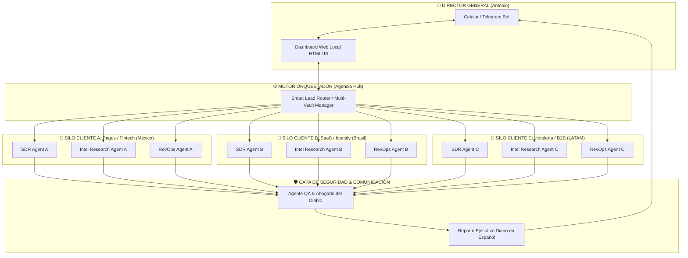
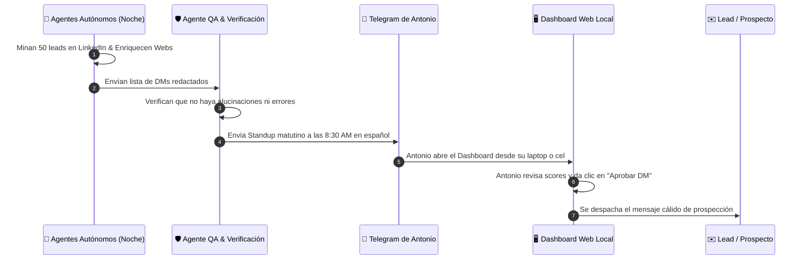

# 🏛️ Arquitectura Maestra: Agencia Digital de Agentes Autónomos (Multi-Cliente)
> **Diseño de Sistema y Blueprint Operativo para Antonio Gutiérrez**  
> *Operación de Prospección B2B Multi-Empresa, Multi-País y Cero Mezcla de Contexto*

---

## 📌 1. Visión General del Sistema

Esta arquitectura permite a **Antonio Gutiérrez** operar como el **Director General (CEO)** de una Agencia de Inteligencia Comercial B2B respaldada por un **Enjambre de Agentes de IA Autónomos** (*Multi-Agent Swarm*).



---

## 📂 2. Estructura Física de Carpetas en tu Laptop

Para garantizar la **Privacidad Total (Zero-Knowledge)** y que nunca se mezclen la data ni las regulaciones de tus clientes, la estructura en tu disco duro se ve así:

```text
📁 C:\Users\Antonio\Agencia_Agentica\
│
├── ⚙️ _shared_engine/                  <-- Motor Central Reutilizable
│   ├── llm_router.py                   <-- Conector a Gemini/Groq/OpenAI/Disier
│   ├── telegram_notifier.py           <-- Enviador de reportes a tu celular
│   └── zero_knowledge_vault.js         <-- Encriptación local de API Keys
│
├── 🏢 cliente_1_paymind_mexico/        <-- CLIENTE 1 (Pagos MX)
│   ├── config.env                      <-- Claves y credenciales de Paymind
│   ├── icp_definition.json             <-- Criterios: CEOs Gasolineras / Retails
│   ├── playbook_dms.md                 <-- Mensajes específicos de SPEI/OXXO
│   └── data_vault.json                 <-- Contactos y pipeline de Paymind
│
├── 🏢 cliente_2_incode_brasil/         <-- CLIENTE 2 (Identidad BR)
│   ├── config.env                      <-- Claves de Incode
│   ├── icp_definition.json             <-- Criterios: VPs de Bancos en Brasil
│   ├── playbook_dms.md                 <-- Mensajes en Portugués (PIX / LGPD)
│   └── data_vault.json                 <-- Contactos de Brasil
│
└── 🏢 cliente_3_toku_saas/             <-- CLIENTE 3 (SaaS Recaudo)
    ├── config.env
    ├── icp_definition.json
    └── data_vault.json
```

---

## 🛠️ 3. Las 4 Capas Tecnológicas (Stack Simplificado)

| Capa | Tecnología Usada | Función en la Agencia | Costo |
| :--- | :--- | :--- | :--- |
| **1. Cerebro IA (LLMs)** | Google Gemini 2.5 Flash + Groq + Disier | Análisis de perfiles, extracción web y razonamiento de DMs. | **$0 USD (Free Tier / Centavos)** |
| **2. Datos & Scraping** | Crawl4AI + HarvestAPI / Apify | Minería viva de perfiles de LinkedIn sin riesgo de baneo. | **BYOK (Fondeado por consumo)** |
| **3. Interfaz Visual** | Dashboard HTML/CSS/JS (Radar Comercial) | Tablero local para ver perfiles, scores y **aprobar en 1-clic**. | **$0 USD (Local)** |
| **4. Notificaciones** | Bot de Telegram (`telegram_notifier.py`) | Recibir el **Standup Ejecutivo Diario** en tu celular. | **$0 USD (Gratis)** |

---

## 🔄 4. Flujo Diario de Operación de Antonio (15 Minutos)



---

## 🚀 5. Próximos Pasos para Construirla Conmigo

No tienes que programar nada desde cero. Yo te voy guiando paso a paso:
1. **Paso 1:** Dejamos lista la carpeta `_shared_engine` en tu equipo.
2. **Paso 2:** Creamos la primera carpeta de cliente (`cliente_1`).
3. **Paso 3:** Conectamos el bot de Telegram y ¡lanzamos la primera prospección!
