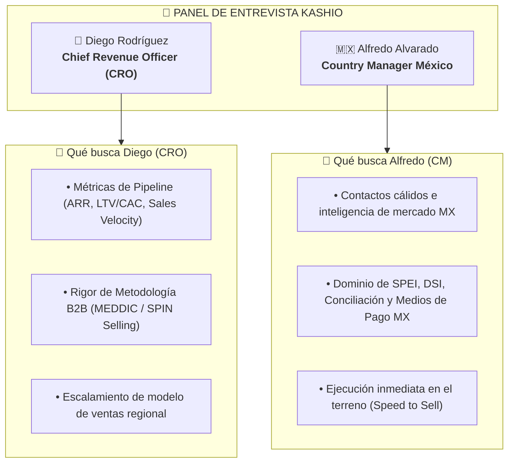

# 🎯 Playbook de Entrevista Ejecutiva: Kashio
> **Candidato:** Antonio Gutiérrez Jiménez  
> **Panel:** Alfredo Alvarado (Country Manager México) & Diego Rodríguez (Chief Revenue Officer - CRO)  
> **Fecha:** Mañana  

---

## 👥 1. ¿Quién es quién en el Panel y qué buscan evaluar?

---

## 💎 2. El Posicionamiento de Antonio (Tu Pitch de 90 Segundos)

> *"Mi trayectoria combina **Adquirencia y Procesamiento Enterprise** (Fiserv y Clip) con **Recaudo Automatizado y Cobranza SaaS Recurrente** (Toku). Entiendo exactamente la pesadilla operativa que sufren las empresas en México con la cartera vencida y la conciliación manual de SPEI. No solo sé cómo vender la tecnología de recaudo de Kashio; tengo la red de contactos activa con CFOs y Directores de Finanzas en México para abrir puertas desde la Semana 1."*

---

## 🎯 3. El Rol de Diego Rodríguez (CRO) y cómo responderle

### ¿Qué hace un CRO?
El **Chief Revenue Officer** es el máximo responsable de todos los ingresos de la empresa (Ventas, Marketing, Customer Success y Expansión). Él no evalúa "ganas de trabajar", evalúa **rigor comercial, estructura de pipeline y previsibilidad de ingresos**.

### La Pregunta Clave de Diego:
> *"Antonio, ¿cuál es tu metodología para calificar un pipeline y evitar perder tiempo en oportunidades que no van a cerrar?"*

### Tu Respuesta Maestra (Usa MEDDIC):
1. **Metrics (Métricas):** *"Identifico el costo financiero de la ineficiencia. Si a un colegio o inmobiliaria le toma 10 días conciliar SPEI y tiene 15% de cartera vencida, traduzco el valor de Kashio en reducción de DSO (Días de Venta Pendientes)."*
2. **Economic Buyer (Comprador Económico):** *"Nunca presento una propuesta sin tener sentado en la mesa al CFO o Director de Finanzas."*
3. **Decision Criteria & Process (Criterios y Proceso de Decisión):** *"Alineo la integración técnica de Kashio con el ERP del cliente (SAP, NetSuite, ERPs propios) desde la cualificación."*

---

## 🇲🇽 4. El Rol de Alfredo Alvarado (Country Manager MX) y cómo responderle

### ¿Qué hace el Country Manager?
Alfredo es responsable del P&L y el crecimiento del mercado mexicano. Él busca alguien que **conozca la realidad local de pagos en México** (SPEI, OXXO Pay, DSI, regulaciones de CNBV/Banxico) y que no requiera 3 meses de capacitación.

### La Pregunta Clave de Alfredo:
> *"Antonio, el mercado en México es complejo y la adopción de nuevas soluciones de recaudo tarda. ¿Cómo piensas atacar los primeros 30-60 días?"*

### Tu Respuesta Maestra:
1. **Targeting Quirúrgico de Verticales de Alta Densidad:** *"Entraremos primero a sectores con dolor sangrante de recaudo masivo: Educación (colegios/universidades), Inmobiliario/Administración de Rentas, Microfinancieras/Fintechs y Venta Directa/SaaS."*
2. **Activación de Warm Network:** *"Aprovecharé mi red de más de 3,000 contactos en la industria de pagos y mi comunidad de LATAM Payments para llegar directo a los tomadores de decisión sin hacer llamada en frío a ciegas."*
3. **Enfoque en Time-to-Value:** *"Demostrar el ROI de Kashio en la primera reunión mostrando cómo la conciliación automática libera 20 horas a la semana del equipo contable."*

---

## ❓ 5. Las 3 Preguntas C-Level que Antonio DEBE Hacerles al Final

Demuestra que piensas como un Director Comercial haciendo estas preguntas estratégicas:

1. **A Diego (CRO):**
   > *"Diego, desde tu perspectiva de CRO regional, ¿cuál es hoy el principal cuello de botella en el embudo comercial en México (conversión de Demo a Cierre o ciclo de integración técnica) y qué esperas que esta posición resuelva en los primeros 90 días?"*
2. **A Alfredo (Country Manager):**
   > *"Alfredo, para la estrategia de Go-To-Market en México, ¿el foco de este trimestre está en construir volumen con cuentas Mid-Market o en cerrar 5-10 cuentas Enterprise de alto ARR?"*
3. **A Ambos (Cierre de Venta Inverso):**
   > *"Basado en lo que hemos platicado hoy sobre mi experiencia en Toku, Fiserv y Clip, ¿hay algún punto o duda sobre mi perfil que no haya quedado 100% claro y que pueda resolver de una vez?"*
