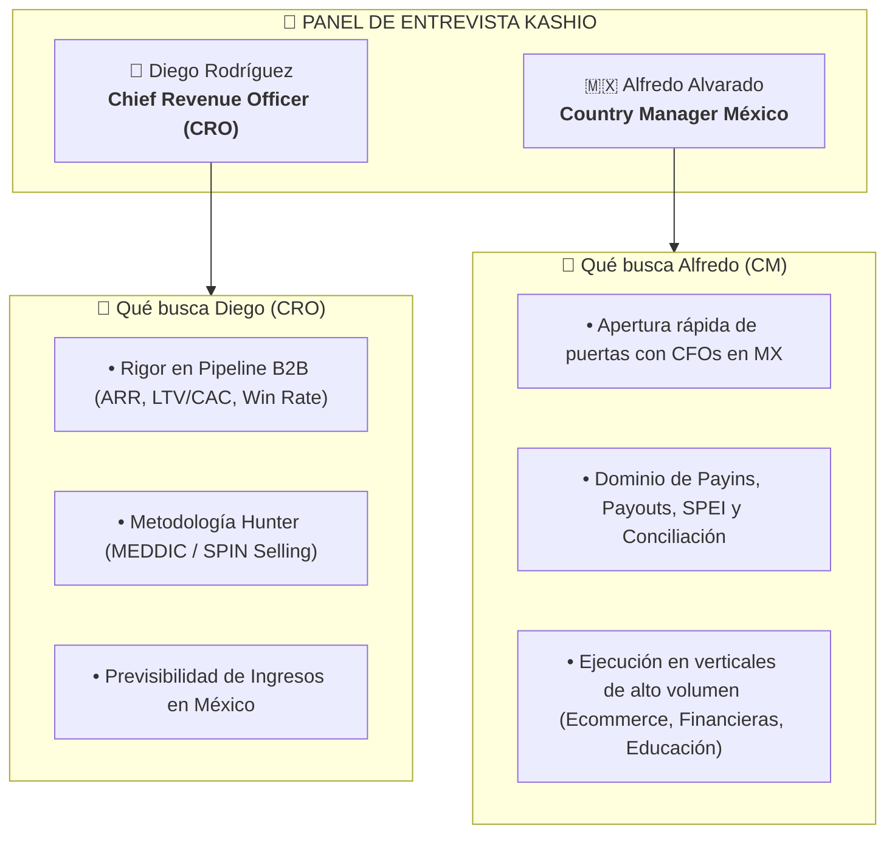

# 🎯 Playbook de Entrevista Ejecutiva: BDM Kashio México
> **Candidato:** Antonio Gutiérrez Jiménez  
> **Posición:** Business Development Manager (BDM) México  
> **Panel:** Alfredo Alvarado (Country Manager México) & Diego Rodríguez (Chief Revenue Officer - CRO)  

---

## 📌 1. Mapeo del Perfil BD (Job Description vs Antonio)

| Requisito del Puesto (Kashio JD) | Lo que aporta Antonio | Tu Factor Diferenciador |
| :--- | :--- | :--- |
| **+4 años en Ventas B2B Fintech / Pagos** | **Fiserv & Clip** | Experiencia en los gigantes de procesamiento y adquirencia B2B en México. |
| **Perfil Hunter & Cierre Corporativo** | **JTI + Fiserv Enterprise** | Rigor comercial de multinacional para negociar con CFOs y Directores de Finanzas. |
| **Red de Contactos en México y LATAM** | **Co-fundador LATAM Payments** | Acceso directo a **+3,000 contactos** de ejecutivos de pagos, ecommerce y fintech. |
| **Conocimiento de Payins, Payouts y Recaudo** | **Especialista en Infraestructura de Pagos** | Dominio total de SPEI, conciliación, adquirencia y dispersión en México. |

---

## 👥 2. Roles del Panel de Entrevista

---

## 💎 3. Tu Pitch Comercial Ajustado (90 Segundos)

> *"Mi trayectoria combina el **procesamiento Enterprise y adquirencia masiva en Fiserv y Clip**, con el rigor de ejecución comercial en **JTI**. Entiendo de primera mano la pesadilla operativa que tienen las empresas en México con la conciliación manual de SPEI, las dispersiones (Payouts) y la cobranza vencida.*
>
> *Además, como co-fundador de la comunidad **LATAM Payments**, cuento con una red activa de **más de 3,000 ejecutivos de finanzas y pagos en la región**. No llego a Kashio a aprender cómo funciona el mercado mexicano ni a hacer llamadas en frío a ciegas; llego con la red de contactos lista para abrir puertas con CFOs desde el primer mes."*

---

## 🎯 4. Respuestas Clave a las Exigencias del Puesto

### A. Para Diego Rodríguez (CRO) — Rigor Hunter y Pipeline
* **Pregunta:** *"Antonio, la vacante exige un perfil 100% Hunter para traer clientes corporativos en Payins, Payouts y Recaudo. ¿Cómo estructuras tu pipeline?"*
* **Tu Respuesta (MEDDIC):**
  1. **Metrics (Métricas):** *"Identifico el costo del dolor: cuántos días de venta pendientes (DSO) tiene la empresa y cuántas horas hombre pierden en conciliación manual."*
  2. **Economic Buyer:** *"Llego directo al CFO, VP de Finanzas o Tesorero, quienes sufren el dolor del flujo de caja."*
  3. **Decision Criteria:** *"Alineo la integración tecnológica de la API de Kashio con su ERP o plataforma interna desde la etapa de cualificación."*

### B. Para Alfredo Alvarado (Country Manager MX) — Go-To-Market en México
* **Pregunta:** *"¿Cuáles son las primeras verticales que atacarías en México según la descripción del puesto?"*
* **Tu Respuesta:**
  1. **Fintechs, Financieras y Cajas:** *"Sufren por la dispersión automática de créditos (Payouts) y el recaudo de cuotas (Payins) con conciliación en tiempo real."*
  2. **Ecommerce y Marketplaces:** *"Necesitan procesar Payins multi-método y reconciliar devoluciones/pagos a comercios."*
  3. **Educación y Real Estate:** *"Tienen cartera vencida recurrente y conciliación manual de fichas de depósito SPEI."*

---

## ❓ 5. Preguntas C-Level que Antonio debe hacer al final

1. **A Diego (CRO):**
   > *"Diego, para este rol de BDM en México, ¿cuál es el ticket promedio o ARR ideal de cuenta corporativa que esperan que traiga el Hunter este año?"*
2. **A Alfredo (Country Manager):**
   > *"Alfredo, en términos de entregables técnicos en México, ¿las integraciones de Kashio ya cuentan con conectores plug-and-play para los principales ERPs/plataformas locales o trabajamos directo con API REST para clientes Enterprise?"*
3. **Cierre Inverso:**
   > *"Con base en mi experiencia en Fiserv, Clip y mi red en LATAM Payments, ¿hay algún punto de mi perfil sobre el cual tengan alguna duda que pueda aclarar de una vez?"*
