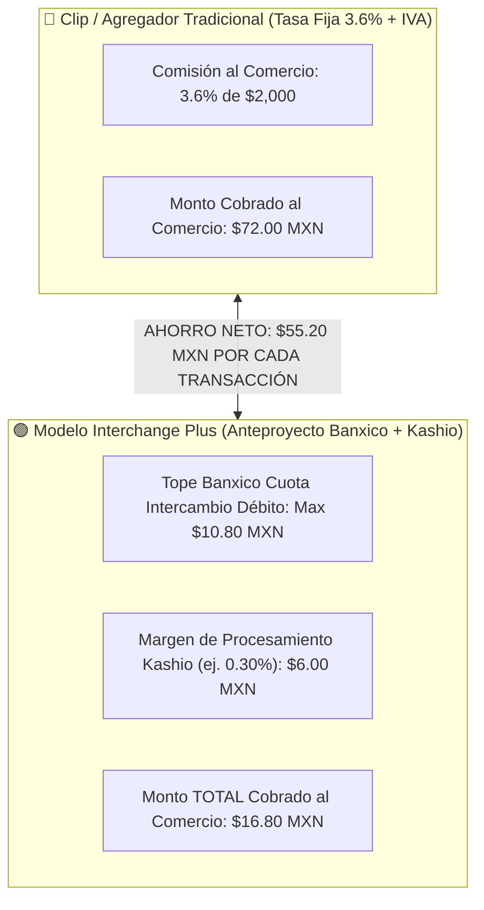

# 📜 Anteproyecto CNBV & Banco de México: Impacto Estratégico en Kashio
> **Análisis Regulatorio de Redes de Medios de Disposición (Cuotas de Intercambio y Tasas de Descuento)**  
> *Arma de Inteligencia Comercial para Antonio Gutiérrez en la Entrevista con Diego Rodríguez (CRO) y Alfredo Alvarado (CM)*

---

## 💳 1. El Desglose Financiero: Cuota de Intercambio vs Tasa de Descuento (MDR)

Hay dos conceptos que se suelen confundir y que representan la ventaja comercial de Antonio:

```text
┌─────────────────────────────────────────────────────────────────────────────┐
│ 1. CUOTA DE INTERCAMBIO (Banxico) ➔ Costo MAYORISTA entre bancos.           │
│    (Lo que el Adquirente le paga al Banco Emisor por procesar la tarjeta).  │
├─────────────────────────────────────────────────────────────────────────────┤
│ 2. TASA DE DESCUENTO (MDR)        ➔ Precio FINAL que paga el comercio.       │
│    (Lo que Clip o Kashio le cobra al cliente por procesar).                 │
└─────────────────────────────────────────────────────────────────────────────┘
```

---

## 📊 2. El Ejemplo Práctico: Carga de $2,000 MXN con Débito en una Gasolinera / Colegio

Imagina una transacción de **$2,000 MXN en Débito** (colegiaturas, gasolineras, distribuidores B2B):



---

## ⚡ 3. ¿Cómo IMPACTA esto a Kashio México?

### 🚀 OPORTUNIDAD 1: Destruir a los Agregadores Tradicionales en Tickets Altos (Débito IC+)
* En tickets de mayor denominación ($1,000 a $10,000 MXN en colegios, gasolineras o distribuidores), el tope de **$10.80 MXN en Cuota de Intercambio de Débito** permite a Kashio ofrecer un modelo **Interchange Plus (IC+)** que pulveriza las tasas fijas del 3.6% de Clip o MercadoPago.

### 🚀 OPORTUNIDAD 2: Recaudo Recurrente B2B vía SPEI (Para Tarjetas de Crédito)
* Para Tarjetas de Crédito, la cuota de intercambio se topa al **1.30%**, lo que sigue siendo un costo porcentual elevado para facturas grandes. Aquí es donde Kashio empuja **A2A / SPEI (costo fijo por transferencia)** como la opción más rentable para el departamento de finanzas.

---

## 💎 4. Frase Maestra para Antonio en la Entrevista

Antonio demuestra un dominio absoluto de la arquitectura de precios con este argumento:

> *"Diego, Alfredo: El tope de $10.80 MXN en la Cuota de Intercambio para Débito abre una ventana gigante en México para tickets altos. En una transacción de $2,000 MXN en un colegio o gasolinera, un agregador tradicional como Clip cobra $72 MXN a tasa fija del 3.6%. Bajo un esquema Interchange Plus aprovechando el tope de Banxico, el costo para el comercio cae a ~$16.80 MXN.*
> 
> *Esto nos da dos armas comerciales imbatibles en Kashio:*
> 1. **Para Débito en Tickets Altos:** *Ofrecer Interchange Plus aprovechando el tope de $10.80 MXN.*
> 2. **Para Pagos de Crédito Recurrentes:** *Ofrecer A2A / SPEI para evitar el 1.30% de intercambio en crédito."*
