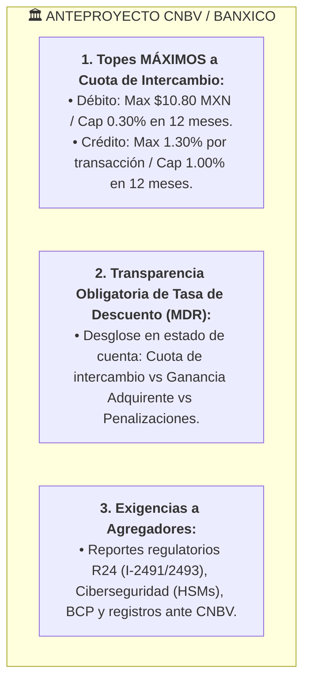

# 📜 Anteproyecto CNBV & Banco de México: Impacto Estratégico en Kashio
> **Análisis Regulatorio de Redes de Medios de Disposición (Cuotas de Intercambio y Tasas de Descuento)**  
> *Arma de Inteligencia Comercial para Antonio Gutiérrez en la Entrevista con Diego Rodríguez (CRO) y Alfredo Alvarado (CM)*

---

## 🏛️ 1. Resumen del Anteproyecto CNBV / Banxico

La CNBV y Banco de México presentaron un anteproyecto regulatorio clave para las redes de tarjetas en México con tres pilares:

---

## ⚡ 2. ¿Cómo IMPACTA esto a Kashio México?

### 🚀 OPORTUNIDAD 1: Aceleración de la Migración a SPEI y Cuentas CLABE (Recaudos Kashio)
* **El Dolor del Mercado:** Al obligar a adquirentes y agregadores a transparentar la Tasa de Descuento (MDR), el CFO de la empresa verá por primera vez el costo real y sangrante de procesar tarjetas de crédito (1.30% + cuota adquirente + IVA).
* **La Ventaja de Kashio:** Las empresas buscarán incentivar el pago vía **SPEI / Cuentas CLABE personalizadas** para compras o pagos de alto monto, eliminando la comisión porcentual de tarjetas. Kashio es el socio ideal para automatizar esa cobranza SPEI.

### 🎯 OPORTUNIDAD 2: Venta de Orquestación Inteligente de Pagos al CFO
* Antonio puede posicionar a Kashio ante los CFOs mexicanos no solo como una pasarela, sino como un **Orquestador Inteligente de Pagos**:
  - Enrutar cobros de alto monto (colegiaturas, rentas, facturas B2B, cuotas de crédito) vía **SPEI/Recaudos Kashio** (menor costo).
  - Enrutar cobros de bajo monto vía tarjetas o tiendas de conveniencia.

### 📋 DESAFÍO/REQUISITO: Cumplimiento Regulatorio para Kashio
* Si Kashio opera bajo la figura de agregador en México para tarjetas, deberá alinearse a los reportes de la **Serie R24 de la CNBV** y a los esquemas de continuidad de negocio (BCP) exigidos en el Anexo 3 del anteproyecto.

---

## 💎 3. La Frase Maestra para Antonio en la Entrevista de Mañana

Cuando surja el tema regulatorio o de la ventaja competitiva en México, Antonio puede lanzar este comentario C-Level:

> *"Diego, Alfredo: Estaba revisando justo hoy el nuevo anteproyecto que lanzaron la CNBV y Banco de México sobre las Redes de Medios de Disposición. Viene un tope a la cuota de intercambio en tarjetas (0.30% en débito y 1.30% en crédito) y la obligación de desglosar la Tasa de Descuento al comercio.*
>
> *Esto es una mina de oro para Kashio en México por dos razones:*
> 1. **Transparencia Fiscal para el CFO:** *Al transparentar los costos de tarjetas, los CFOs buscarán alternativas para mover volumen recurrente hacia **SPEI y Cuentas CLABE**, que es exactamente el fuerte de Recaudos Kashio.*
> 2. **Orquestación Inteligente:** *Podemos venderle al CFO la capacidad de orquestar pagos: enrutar cobros de alto valor por SPEI (ahorrando miles de pesos en comisiones de tarjeta) y cobros menores por tarjeta o efectivo."*
