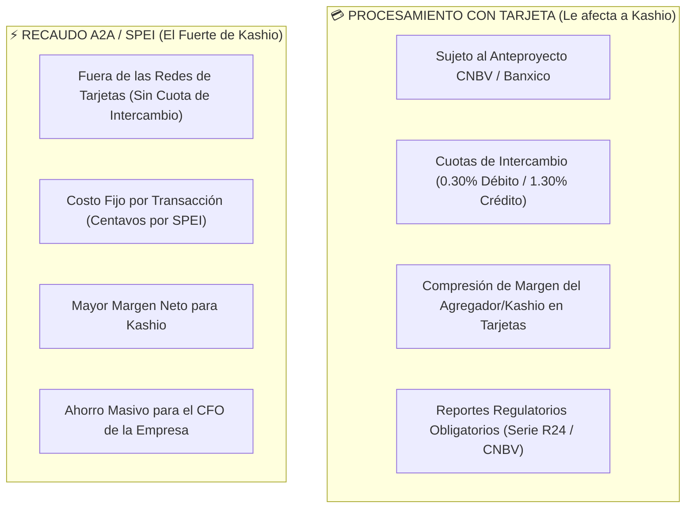

# 📜 Anteproyecto CNBV & Banco de México: Impacto Estratégico en Kashio
> **Análisis Regulatorio de Redes de Medios de Disposición (Cuotas de Intercambio y Tasas de Descuento)**  
> *Arma de Inteligencia Comercial para Antonio Gutiérrez en la Entrevista con Diego Rodríguez (CRO) y Alfredo Alvarado (CM)*

---

## 🏛️ 1. La Distinción Clave de Antonio: Tarjeta vs A2A (SPEI)

Hay una diferencia fundamental que Antonio identifica con total precisión: **NO ES LO MISMO PROCESAR TARJETAS QUE TRANSFERIR CUENTA A CUENTA (A2A / SPEI).**

---

## ⚡ 2. ¿Cómo IMPACTA esto a Kashio México?

### ⚠️ El Impacto Negativo en Tarjetas para Kashio:
* Si Kashio actúa como agregador de tarjetas en México cobrando una tasa de descuento porcentual, **el anteproyecto comprimirá sus márgenes en el procesamiento con tarjeta**, además de imponerle la carga operativa de transparentar el desglose (MDR) y remitir reportes a la CNBV (Serie R24).

### 🚀 La Oportunidad Estratégica: Empujar A2A / SPEI / Recaudos Directos
* **La Ventaja de Kashio:** Debido a que el procesamiento de tarjeta tendrá márgenes más apretados y mayor regulación, la estrategia de Kashio en México debe enfocarse agresivamente en **A2A (Account-to-Account / SPEI vía Cuentas CLABE dedicadas)**.
* **El Beneficio Doble:**
  1. **Para Kashio:** Cero dependencia de cuotas de intercambio de Visa/Mastercard; mejor margen neto en tarifas fijas por SPEI.
  2. **Para el CFO:** El cliente se ahorra la comisión porcentual de tarjeta y Kashio le resuelve la conciliación automática.

---

## 💎 3. La Frase de Nivel Experto para Antonio en la Entrevista

Antonio demuestra un conocimiento profundo de la industria con este comentario:

> *"Diego, Alfredo: Estaba revisando el anteproyecto de la CNBV y Banxico sobre las Redes de Tarjetas. Es claro que a cualquier jugador que procese tarjeta en México le va a apretar los márgenes y la carga regulatoria (Serie R24).*
> 
> *Sin embargo, la gran oportunidad para Kashio en México está en que **cobrar con tarjeta no es lo mismo que transferir A2A (SPEI)**. Al transparentarse los costos de las tarjetas, nuestra mejor jugada comercial es empujar fuertemente **el Recaudo A2A / SPEI**, que está libre de cuotas de intercambio, le ahorra dinero al CFO y le da a Kashio un margen limpio y predecible."*
