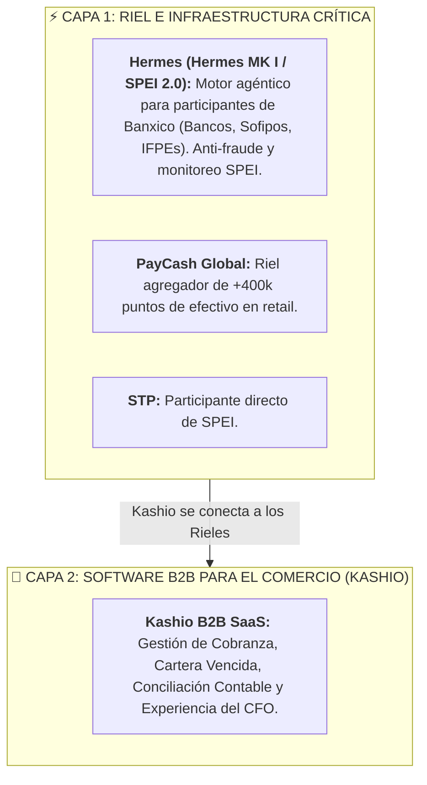
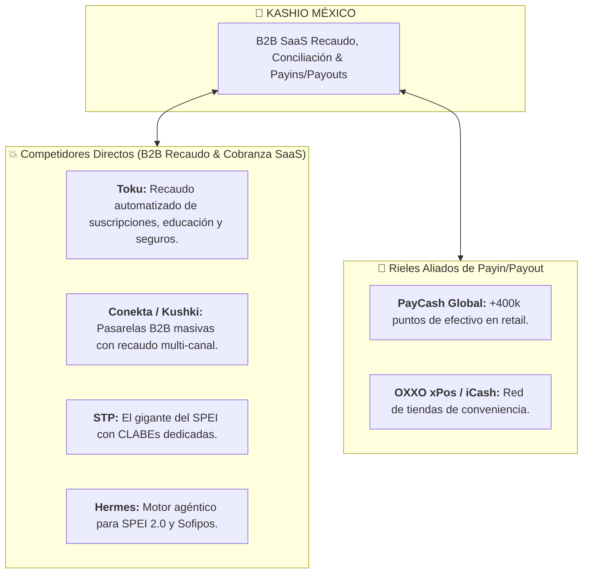

# 🛡️ Análisis Estratégico de Mercado en México: Kashio
> **Inteligencia Competitiva, Fricciones Operativas y Barreras de Entrada**  
> *Material de Preparación C-Level para la Entrevista con Diego Rodríguez (CRO) y Alfredo Alvarado (Country Manager MX)*

---

## 🦅 0. INTEL DE INFRAESTRUCTURA: Hermes (Motor Agéntico SPEI) vs Kashio vs PayCash

Hay una distinción clave en el ecosistema mexicano que demuestra tu dominio de la industria de pagos:

### 1. ¿Quién es Hermes (`atlas.hermes.ng`) y cómo se posiciona?
* **¿Qué es?:** Es una infraestructura agéntica de código abierto para pagos instantáneos SPEI, enfocado en **participantes directos e indirectos de Banxico** (Bancos, Sofipos, Socaps, Fintechs). Monitorea el CEP del Banxico, anti-fraude y cumplimiento normativo.
* **¿Es competencia de Kashio?:** 
  * **Sí en la capa técnica profunda** si Kashio le vende a Sofipos/Bancos para monitoreo de SPEI.
  * **No en la capa comercial B2B:** Hermes le vende a la infraestructura financiera; Kashio le vende al **CFO de la empresa corporativa** (educación, inmobiliarias, e-commerce, SaaS) para resolver la cobranza y la cartera vencida.

---

### 2. PayCash Global: El Aliado de Payin en Efectivo
* PayCash no es competencia de software para Kashio; es un **aliado estratégico de Payin en efectivo** para ofrecer +400,000 puntos de retail (OXXO, 7-Eleven, Farmacias) en 1 sola API.

---

## 🏬 0.1. Transformación de Recaudo y Efectivo en México (OXXO / Retail)

El caso de éxito reciente de **Ochouno® en OXXO (xPos / iCash)** afectando a más de 25,000 puntos de venta y 7,400+ colaboradores revela la velocidad con la que las redes de retail están digitalizando el retiro y depósito de efectivo.

---

## ⚔️ 1. Mapa de Competencia en México

---

## ⚠️ 2. Las 4 Fricciones Operativas Clave en México

1. **La Fricción Fiscal del SAT (CFDI 4.0 y Complementos de Pago):**
   * Por cada pago registrado, la empresa debe timbrar ante el SAT un **Complemento de Recepción de Pagos (CRP)**.
2. **Resistencia a Pagar Comisiones por SPEI:**
   * Los CFOs están acostumbrados a que las transferencias entre cuentas de cheques sean "gratuitas".
   * *Estrategia:* Cambiar la conversación de *"Costo por transacción"* a *"Reducción de DSO y Ahorro en horas-hombre contables"*.
3. **Adopción de OXXO Pay y Métodos Alternativos:**
   * Ofrecer el ecosistema híbrido (SPEI instantáneo + PayCash / OXXO Pay / Retiros con confirmación en tiempo real).
4. **Temor a la Migración Tecnológica:**
   * Vender un *Onboarding Guiado con Time-to-Value corto* (demostrar valor en 2 semanas).

---

## 💎 3. Frase Maestra para la Entrevista (Aclaración Riel vs SaaS)

> *"Diego, Alfredo: En México tenemos muy clara la diferencia entre **los Rieles de Infraestructura** (como STP, Hermes para el motor agéntico SPEI 2.0 o PayCash para los 400k puntos de efectivo) y **el Software B2B de Cobranza (Kashio)**.*
> 
> *Los rieles mueven los bits y el dinero; **Kashio le resuelve la vida al CFO de la empresa**, automatizando la conciliación, eliminando la cartera vencida y cerrando el ciclo contable. Nuestra ventaja como BDM no es pelear por la infraestructura, es adueñarnos de la relación comercial con el departamento de finanzas de las empresas en México."*
