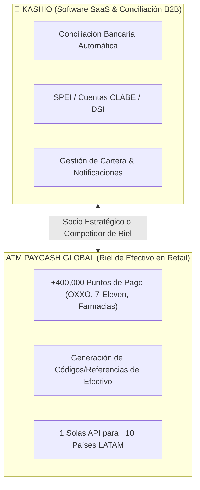
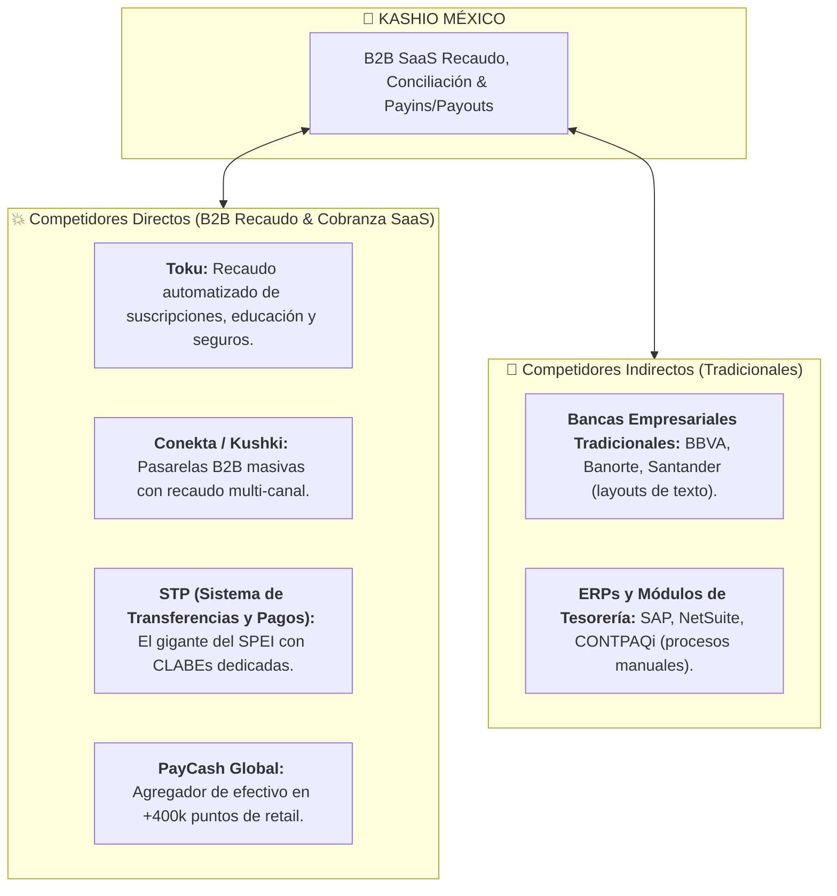

# 🛡️ Análisis Estratégico de Mercado en México: Kashio
> **Inteligencia Competitiva, Fricciones Operativas y Barreras de Entrada**  
> *Material de Preparación C-Level para la Entrevista con Diego Rodríguez (CRO) y Alfredo Alvarado (Country Manager MX)*

---

## 🌐 0. INTEL CLAVE: PayCash Global vs Kashio (El Conector de 400K Puntos de Pago)

**PayCash Global (`paycashglobal.com`)** es uno de los agregadores de recaudo en efectivo más grandes de Latinoamérica (+400,000 puntos de pago en tiendas de conveniencia, farmacias y supermercados conectados con 1 sola API).

### ¿Por qué PayCash es RELEVANTE para la entrevista con Kashio?

1. **La Oportunidad de Alianza / Integración:**
   * Kashio no necesita ir a negociar de tienda en tienda (OXXO, 7-Eleven, Farmacias del Ahorro) en México. 
   * A través de agregadores como **PayCash Global**, Kashio puede ofrecer **Payins en efectivo en 400,000 puntos** con 1 sola integración API, complementando su motor de conciliación bancaria SPEI.
2. **El Posicionamiento Diferenciador contra PayCash:**
   * PayCash es un *agregador de código de barras/efectivo*. No ofrece la **capacidad SaaS de gestión de cobranza, conciliación contable automática ni automatización B2B** que tiene Kashio.
   * Antonio puede argumentar: *"PayCash pone el código en el ticket; Kashio resuelve la conciliación, el flujo contable y el cierre de la factura para el CFO."*

---

## 🏬 0.1. Transformación de Recaudo y Efectivo en México (OXXO / Retail)

El caso de éxito reciente de **Ochouno® en OXXO (xPos / iCash)** afectando a más de 25,000 puntos de venta y 7,400+ colaboradores revela la velocidad con la que las redes de retail están digitalizando el retiro y depósito de efectivo.

---

## ⚔️ 1. Mapa de Competencia en México

---

## ⚠️ 2. Las 4 Fricciones Operativas Clave en México

1. **La Fricción Fiscal del SAT (CFDI 4.0 y Complementos de Pago):**
   * Por cada pago registrado, la empresa debe timbrar ante el SAT un **Complemento de Recepción de Pagos (CRP)**.
2. **Resistencia a Pagar Comisiones por SPEI:**
   * Los CFOs están acostumbrados a que las transferencias entre cuentas de cheques sean "gratuitas".
   * *Estrategia:* Cambiar la conversación de *"Costo por transacción"* a *"Reducción de DSO y Ahorro en horas-hombre contables"*.
3. **Adopción de OXXO Pay y Métodos Alternativos:**
   * Ofrecer el ecosistema híbrido (SPEI instantáneo + PayCash / OXXO Pay / Retiros con confirmación en tiempo real).
4. **Temor a la Migración Tecnológica:**
   * Vender un *Onboarding Guiado con Time-to-Value corto* (demostrar valor en 2 semanas).

---

## 💎 3. Cómo usar este conocimiento en tu entrevista (Tu "Cierre de Consultor")

> *"Diego, Alfredo: Cuando analizas el mercado mexicano, ves que jugadores como **PayCash Global** dominan el riel de efectivo en retail con 400k puntos, pero **carecen de la capa de inteligencia SaaS y conciliación automática B2B** que tiene Kashio.*
> 
> *PayCash genera el código para la tienda; Kashio le resuelve la vida al CFO automatizando la conciliación, el control de cartera vencida y el flujo contable. Mi estrategia comercial como BDM en México será posicionar a Kashio como esa capa superior de orquestación e inteligencia financiera que las empresas necesitan."*
