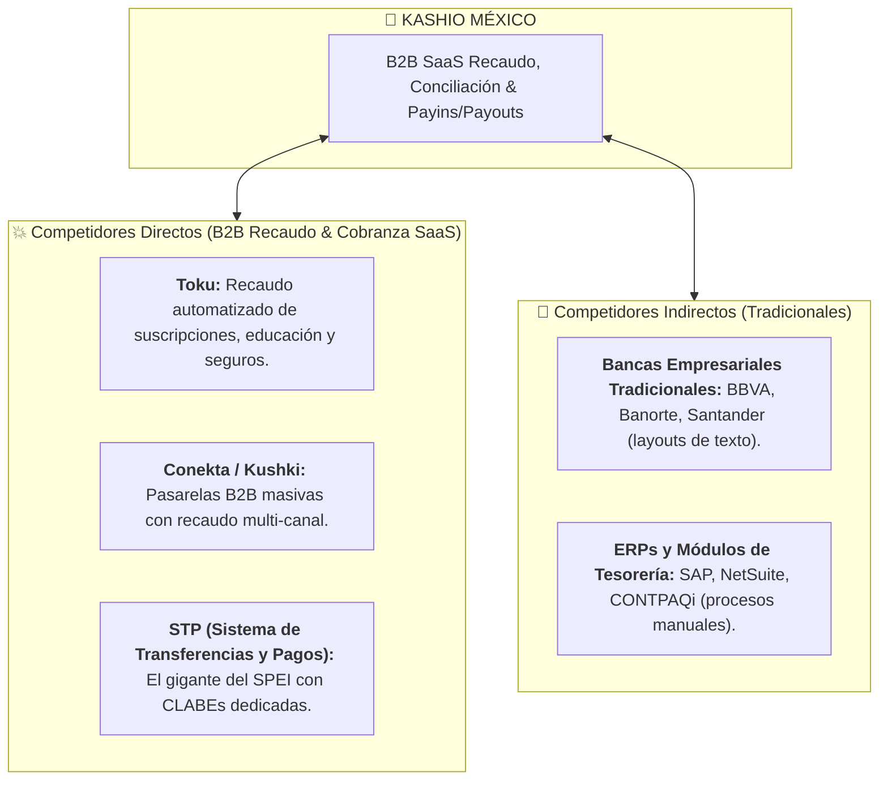

# 🛡️ Análisis Estratégico de Mercado en México: Kashio
> **Inteligencia Competitiva, Fricciones Operativas y Barreras de Entrada**  
> *Material de Preparación C-Level para la Entrevista con Diego Rodríguez (CRO) y Alfredo Alvarado (Country Manager MX)*

---

## ⚔️ 1. Mapa de Competencia en México

---

## ⚠️ 2. Las 4 Fricciones Operativas Clave en México

Para cerrar clientes Enterprise y Mid-Market en México, Kashio y su equipo comercial deben resolver estas 4 objeciones/fricciones reales:

1. **La Fricción Fiscal del SAT (CFDI 4.0 y Complementos de Pago):**
   * **El Dolor:** En México, no basta con recibir el dinero. Por cada pago registrado, la empresa debe timbrar ante el SAT un **Complemento de Recepción de Pagos (CRP)**.
   * **La Solución Comercial de Antonio:** Demostrar cómo Kashio se integra con el PAC o ERP del cliente para automatizar la conciliación **y la emisión fiscal simultánea**.
2. **Resistencia a Pagar Comisiones por SPEI:**
   * **El Dolor:** Los CFOs en México están acostumbrados a que las transferencias bancarias entre cuentas de cheques sean "gratuitas" en la banca empresarial.
   * **La Solución Comercial de Antonio:** Cambiar la conversación de *"Costo por transacción"* a *"Reducción de DSO (Días de Venta Pendientes) y Ahorro en horas-hombre contables"*. Demostrar que perder 20 horas a la semana conciliando manualmente cuesta 5 veces más que la plataforma de Kashio.
3. **Adopción de OXXO Pay y Métodos Alternativos:**
   * **El Dolor:** En verticales como Educación, Financieras y Servicios, el 30%+ de los usuarios sigue pagando en efectivo o conveniencia.
   * **La Solución Comercial de Antonio:** Ofrecer un ecosistema híbrido fluido (SPEI instantáneo + OXXO Pay con notificación en tiempo real).
4. **Temor a la Migración Tecnológica:**
   * **El Dolor:** El equipo contable/financiero tiene miedo de que la integración por API interrumpa su operación diaria.
   * **La Solución Comercial de Antonio:** Vender un proceso de *Onboarding Guiado con Time-to-Value corto* (demostrar valor en las primeras 2 semanas).

---

## 🛡️ 3. Barreras de Entrada en México

1. **La Barrera de Confianza (Trust Barrier) con Cuentas Corporativas:**
   * Las empresas mexicanas son cautelosas al entregar la orquestación de su cobranza a una fintech extranjera si no ven respaldo y ejecutivos locales reconocidos.
   * **El Factor Antonio:** Tu pedigree en **Fiserv y Clip**, sumado a tu liderazgo en **LATAM Payments (+3,000 contactos)**, rompe de inmediato la barrera de desconfianza.
2. **Infraestructura SPEI de Ultra-Baja Latencia:**
   * Quien no tenga conciliación instantánea mediante CLABEs interbancarias personalizadas se queda fuera del segmento Enterprise.
3. **Adaptación a Normativas de la CNBV y Ley Fintech:**
   * Operar transparente bajo las figuras de agregación y procesamiento de fondos de terceros en México.

---

## 💎 4. Cómo usar este conocimiento en tu entrevista (Tu "Cierre de Consultor")

Cuando les demuestres que entiendes estas fricciones, pasarás de ser un candidato común a ser el **Socio Estratégico que necesitan para tomar el mercado en México**.

> *"Diego, Alfredo: El mercado de recaudo en México tiene dos barreras muy claras que la competencia no ha resuelto bien: **la conciliación fiscal ante el SAT** y **la resistencia del CFO a pagar por automatizar SPEI**.
> 
> En Fiserv y Clip aprendí que en México no le vendes a la tecnología, le vendes al dolor financiero del CFO. Mi estrategia como BDM no es salir a vender 'pasarelas de pago', es salir a vender **Reducción de Cartera Vencida y Automatización Contable** a mi red de contactos desde el Día 1."*
