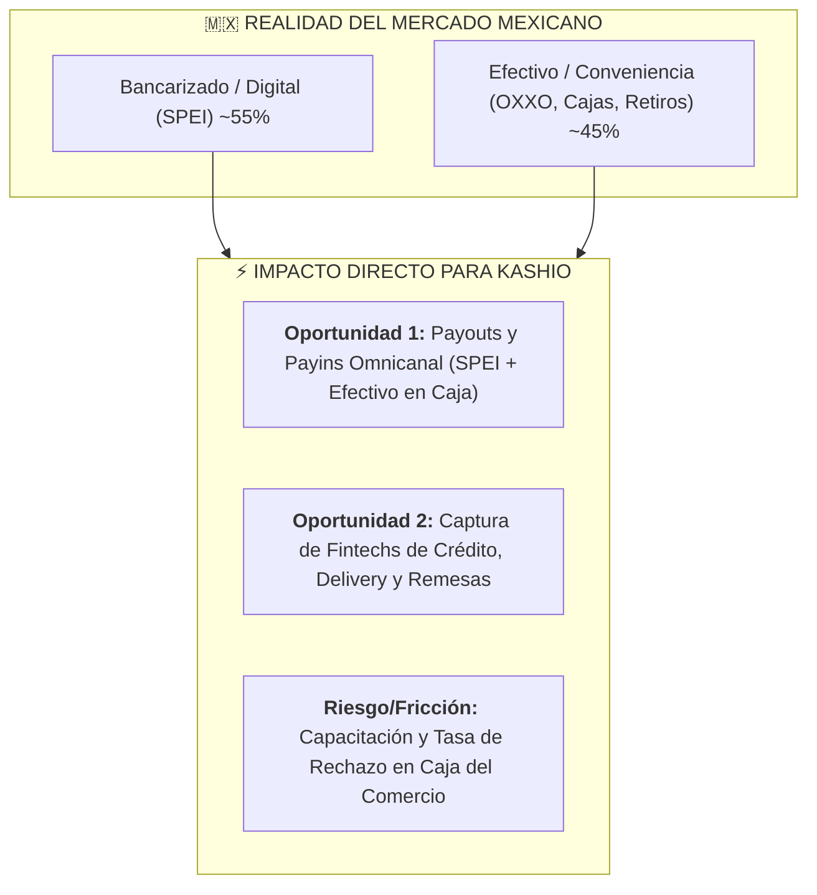
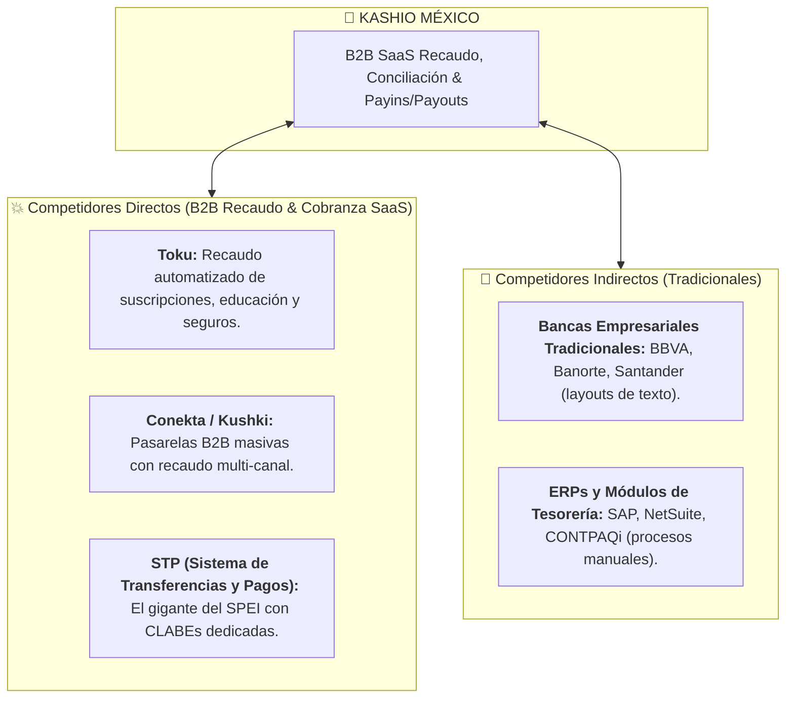

# 🛡️ Análisis Estratégico de Mercado en México: Kashio
> **Inteligencia Competitiva, Fricciones Operativas y Barreras de Entrada**  
> *Material de Preparación C-Level para la Entrevista con Diego Rodríguez (CRO) y Alfredo Alvarado (Country Manager MX)*

---

## 🏬 0. INTEL DE ÚLTIMA HORA: La Transformación de Recaudo y Efectivo en México (OXXO / Retail)

El caso de éxito reciente de **Ochouno® en OXXO (xPos / iCash)** afectando a más de 25,000 puntos de venta y 7,400+ colaboradores revela el **movimiento tectónico del mercado mexicano en depósitos y retiros de efectivo (Cash-In / Cash-Out)**.

### ¿Por qué esto IMPACTA DIRECTAMENTE a Kashio en México?

1. **La Omnicanalidad Real (Payins + Payouts en Efectivo):**
   * En México, el 40%+ de los usuarios de Financieras, Cajas Populares, Apps de Delivery (Uber/DiDi) y Gaming necesitan **retirar efectivo (Payouts) o depositar (Payins)** en tiendas de conveniencia sin ir a una sucursal bancaria.
   * Si Kashio solo vende transferencia SPEI, pierde la mitad del mercado. Integrar redes de recaudo y retiros en caja (como OXXO xPos/iCash) convierte a Kashio en una **Infraestructura de Pagos Total**.
2. **La Fricción del Cajero y la Operación:**
   * El estudio demuestra que el verdadero problema en México no es la API, sino la **adopción operativa del cajero en la tienda**. Si el proceso de depósito/retiro es complejo, el cajero rechaza la transacción.
   * Kashio debe garantizar un flujo de API ultraligero con confirmación en tiempo real para evitar fricción en caja.

---

## ⚔️ 1. Mapa de Competencia en México

---

## ⚠️ 2. Las 4 Fricciones Operativas Clave en México

1. **La Fricción Fiscal del SAT (CFDI 4.0 y Complementos de Pago):**
   * Por cada pago registrado, la empresa debe timbrar ante el SAT un **Complemento de Recepción de Pagos (CRP)**.
2. **Resistencia a Pagar Comisiones por SPEI:**
   * Los CFOs están acostumbrados a que las transferencias entre cuentas de cheques sean "gratuitas".
   * *Estrategia:* Cambiar la conversación de *"Costo por transacción"* a *"Reducción de DSO y Ahorro en horas-hombre contables"*.
3. **Adopción de OXXO Pay y Métodos Alternativos:**
   * Ofrecer el ecosistema híbrido (SPEI instantáneo + OXXO Pay / Retiros con confirmación en tiempo real).
4. **Temor a la Migración Tecnológica:**
   * Vender un *Onboarding Guiado con Time-to-Value corto* (demostrar valor en 2 semanas).

---

## 2. Cómo usar este conocimiento en tu entrevista

> *"Diego, Alfredo: Estaba analizando la infraestructura reciente de recaudo y retiros en México. Con la transformación de **más de 25,000 tiendas de OXXO (sistema iCash/xPos de depósitos y retiros)**, queda claro que en México la jugada ganadora para Kashio no es solo SPEI digital, sino la **Omnicanalidad Total de Payins y Payouts (SPEI + Efectivo)**.*
> 
> *Para verticales como Financieras, Cajas, Delivery y Educación, ofrecer conciliación en tiempo real tanto en transferencias como en caja de conveniencia es la clave para desplazar a la banca tradicional y a los competidores antiguos."*
