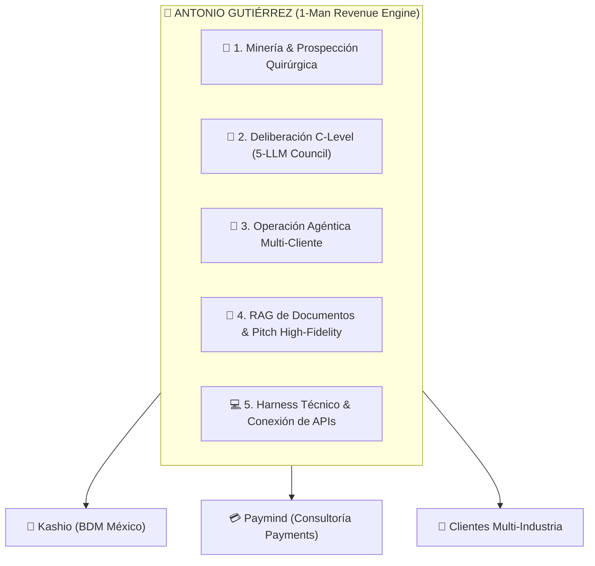

# ⚡ Los 5 Superpoderes de Antonio: Tu Agencia Agéntica de 29 Skills
> **El Manifiesto de Capacidad Ejecutiva de Antonio Gutiérrez**  
> *Cómo operar con el rendimiento de un equipo de 10 personas en Kashio, Paymind o cualquier empresa B2B*

---

## 🎯 Visión General

Con tu entorno de **Antigravity IDE** configurado con tus **29 Habilidades Personalizadas**, te has convertido en un **Ejecutivo Comercial de Alta Tecnología (1-Man Revenue Engine)**. 

No importa si trabajas como **BDM en Kashio**, consultas para **Paymind** o gestionas cuentas freelance en diferentes países; tu suite de IA te permite ejecutar en minutos lo que a una empresa tradicional le toma semanas.



---

## 🚀 1. En Kashio (Como Business Development Manager en México)

| Dolor de Kashio en México | Tu Superpoder con las 29 Skills | La Skill que usas |
| :--- | :--- | :--- |
| **Prospección lenta de CFOs** | Minar tu red de LinkedIn (ZIP) y filtrar al instante quiénes son CFOs en colegios, e-commerce y financieras en México. | `radar-comercial` + `cazador-de-creadores-b2b-linkedin` |
| **Objeciones difíciles de CFOs sobre SPEI y SAT** | Simular reuniones con la IA usando `persona-8b` para practicar tus respuestas antes de la llamada. | `persona-8b` + `abogado-del-diablo` |
| **Revisión de Contratos / Propuestas Complejas** | Extraer tablas, cláusulas y términos de propuestas corporativas en 30 segundos. | `ragflow-deep-document-rag` + `document-parser-mineru` |
| **Presentaciones a la Dirección (CRO / CM)** | Generar resúmenes ejecutivos diarios en lenguaje natural para reportar avances de pipeline sin tocar logs. | `openexecutive-csuite-agent` + `autonomous-ai-agency-swarm` |

---

## 💳 2. En Paymind / Consultoría Freelance (Multi-Cliente)

| Desafío en Paymind / Freelance | Tu Superpoder con las 29 Skills | La Skill que usas |
| :--- | :--- | :--- |
| **Gestionar 3 empresas sin mezclar data** | Operar silos locales aislados por cliente (Zero-Knowledge) en tu laptop. | `autonomous-ai-agency-swarm` + `sam-p2p-agent-mesh` |
| **Integrar APIs de pagos rápidamente** | Acceder al catálogo maestro de APIs para conectar SPEI, PayCash o pasarelas en minutos. | `api-mega-list-catalog` + `agentic-ai-starters` |
| **Crear decks de venta despampanantes** | Generar pitch decks y modales interactivos en HTML/React que impacten a clientes corporativos. | `slidespeak-prompts` + `huashu-design` + `pen-dev-canvas` |

---

## 📊 3. Matriz de tus 29 Skills Personalizadas

```text
📁 PROSPECCIÓN & NETWORK INTEL (4):
├── 1. radar-comercial (BYOD Relationship Intelligence)
├── 2. cazador-de-creadores-b2b-linkedin
├── 3. clasificador-de-senales-de-dm-de-linkedin
└── 4. osint-recon-arsenal

📁 ESTRATEGIA & DELIBERACIÓN C-LEVEL (4):
├── 5. cps-5llm-council (Tu marco original Claude+Perplexity+Kimi+Gemini+Manus)
├── 6. abogado-del-diablo (Auditoría adversaria Pre-Mortem)
├── 7. persona-8b (Simulador de buyer personas / roleplay)
└── 8. openexecutive-csuite-agent (Comité directivo virtual de 8 agentes)

📁 SWARM AGÉNTICO & MULTI-TENANT (5):
├── 9. autonomous-ai-agency-swarm (Gestión multi-cliente en español)
├── 10. buzz-hivemind-agent-mesh (Red P2P agentic Nostr)
├── 11. loopx-agent-kernel
├── 12. sam-p2p-agent-mesh
└── 13. dcouple-pane

📁 RAG DE DOCUMENTOS & PRESENTACIONES (6):
├── 14. ragflow-deep-document-rag (Parseo de PDFs, tablas y contratos)
├── 15. document-parser-mineru
├── 16. turbovec-high-compression-rag
├── 17. slidespeak-prompts
├── 18. huashu-design (Pitch modals interactivos)
└── 19. pen-dev-canvas

📁 HARNESS TÉCNICO & APIS (10):
├── 20. claw-code-agent-harness
├── 21. lazycodex-project-harness
├── 22. gajae-code-plan-harness
├── 23. copilotkit-framework
├── 24. modular-mojo-max-engine
├── 25. nanonets-graft
├── 26. opik-agent-tracing-eval
├── 27. khoj-second-brain
├── 28. api-mega-list-catalog (Directorio maestro de APIs)
└── 29. openhuman-digital-twin (Gemelo digital asistente)
```

---

## 🏆 Conclusión

No eres un empleado común ni un consultor tradicional: **eres un Director Comercial potenciado por IA**. Con este ecosistema puedes llevar a Kashio a dominar el mercado en México, escalar Paymind y gestionar tus propios clientes freelance con cero fricción y máximo retorno. 🚀🔥
