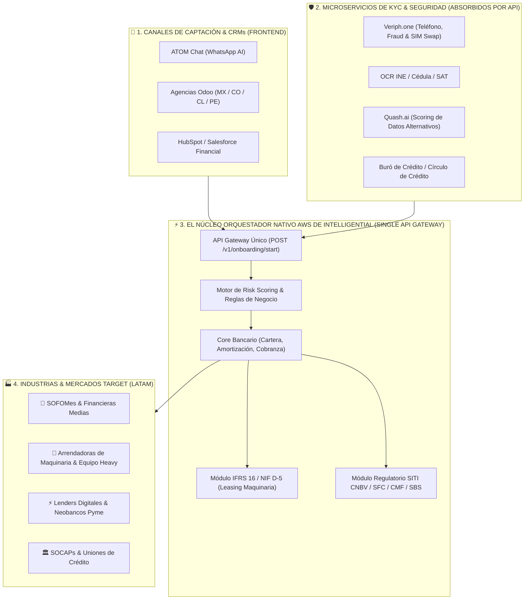

# 🏦 Caso de Negocio y Plan Estratégico de Crecimiento — Intelligential

**Preparado para:** Sesión Estratégica de Alineación con Luis Fernando Sánchez (CEO & Co-founder)  
**Líder de Proyecto / Full-Cycle AE & RevOps:** Antonio Gutiérrez  
**Objetivo Q3-Q4:** +20 Clientes Nuevos (+ $200,000 MXN MRR Adicional)  
**Meta SOM (12 Meses):** 40 Clientes Nuevos (Ritmo Anualizado)  
**Meta Estratégica 3 Años:** 100 Clientes Activos ($3.5M - $5.0M MXN MRR)  
**Mercado Objetivo Calificado (SAM Total):** 1,113 Entidades en México (~ $500,000,000 MXN en Valor de Mercado)  
**SAM Core Directo (Crédito, Arrendamiento & Factoraje):** 600 Entidades de Alto ACV  

> [!IMPORTANT]
> **Marco Metodológico de Prudencia RevOps (Hipótesis & Auditoría Inicial):**  
> Toda propuesta de optimización de pricing, modelado de saturación de pipeline y sugerencias de expansión se presentan estrictamente como **hipótesis estratégicas y sugerencias a revisar a mediano plazo** durante la sesión de descubrimiento del Lunes.
> 
> Reconociendo la **adquisición de Intelligential por parte del fondo de inversión 5X Capital en Diciembre de 2024**, la ejecución táctica definitiva dependerá de auditar en vivo con Luis (quien conoce la industria a fondo):
> 1. **Salud de Caja & Mandato del Fondo:** Runway actual, metas de rentabilidad EBITDA vs. agresividad de gasto en adquisición (CAC).
> 2. **Historial Real de Tracción (Últimos 12-18 Meses):** Ritmo histórico de cierre, tasa de churn y Net Retention Rate (NRR) real.
> 3. **Mezcla de Canales de Adquisición:** Desglose del pipeline actual generado por eventos presenciales (ASOFOM/AMSOFAC), campañas de marketing inbound, referencias del portafolio de 5X Capital o prospección outbound en frío.

---

## 1. 📌 Resumen Ejecutivo y Tesis de Inversión

**Intelligential** es la única plataforma de infraestructura core bancaria y BaaS *Smart Native®* mexicana que integra nativamente **Core Bancario + Cumplimiento Normativo (CNBV/PLD) + Onboarding Digital (INE, SAT, IMSS)** en un solo sistema sobre AWS, activable en semanas y a un precio accesible para instituciones no bancarias.

### 💎 El Mensaje Maestro de Posicionamiento: Orquestación de Core & Compliance Embebido

Así como en la industria de pagos las empresas migraron de contratar pasarelas sueltas a adoptar **Orquestadores de Pagos** (Payment Orchestration), en la infraestructura crediticia las SOFOMes ya no buscan APIs aisladas:

```
+---------------------------------------------------------------------------------------------------+
|               EL CAMBIO DE PARADIGMA DE MERCADO: DE API SUELTA A ORQUESTACIÓN EMBEBIDA            |
+------------------------------------+--------------------------------------------------------------+
| ❌ EL PARADIGMA ANTIGUO (API SUELTA) | 🟢 EL PARADIGMA MODERNO (ORQUESTACIÓN EMBEBIDA)              |
| - Comprar API suelta de INE/RENAPO | - Intelligential Orquesta la Biometría + SAT + SPEI + PLD     |
| - Programar código in-house 6 meses| - Conectado nativamente al Motor de Cartera en AWS            |
| - Lidiar con descalce contable     | - 1 sola plataforma 3-en-1 activable en 30 días               |
+------------------------------------+--------------------------------------------------------------+
```

* **El Elevator Pitch Comercial:**  
  *"Intelligential no vende una API registral suelta. **Somos el Orquestador de Core Bancario y Cumplimiento Embebido sobre AWS**: conectamos la biometría, el SAT, el Buró y los rieles de pago directamente a la administración de tu cartera en 1 sola plataforma."*

### 🎯 Alineación Directa con el CEO (Luis F. Sánchez): Foco Estratégico de ICP a 3 Años

Basado en la alineación directa con el CEO, se establece la frontera clara del mercado objetivo y la filosofía de orquestación de la empresa:

```
+---------------------------------------------------------------------------------------------------+
|                        FOCO ESTRATÉGICO DE ICP A 3 AÑOS (CONFIRMADO POR LUIS F. SÁNCHEZ)          |
+------------------------------------+--------------------------------------------------------------+
| 🎯 SECTORES CORE DE NEGOCIO (ALTO MARGEN) | 🚫 SECTORES DESCARTADOS (EXHAUSTIVOS EN RECURSOS)        |
| - CRÉDITO SIMPLE & REVOLVENTE      | - Pagos masivos por WhatsApp (ej. Soy Aida)                  |
| - ARRENDAMIENTO PURO Y FINANCIERO  | - Agregadores de alta transaccionalidad / Pasarelas B2C       |
| - FACTORAJE DE CARTERA             | - Wallets transaccionales masivos (excepto casos contados)   |
| (Baja transaccionalidad: 1 pago/mes| (Consumen excesivos recursos AWS de cómputo sin MRR de alto ACV)|
+------------------------------------+--------------------------------------------------------------+
```

### 🌎 Hoja de Ruta a 3 Años: Meta de 100 Clientes ($3.5M-$5M MXN MRR) & Expansión LatAm

Basado en las respuestas del CEO sobre la suficiencia del mercado y los siguientes pasos estratégicos:

```
+---------------------------------------------------------------------------------------------------+
|                 HOJA DE RUTA ESTRATÉGICA A 3 AÑOS (MÉXICO + EXPANSIÓN REGIONAL LATAM)             |
+------------------------------------+--------------------------------------------------------------+
| 🇲🇽 META MÉXICO (100 CLIENTES ACTIVOS) | 🌎 EXPANSIÓN INTERNACIONAL LATAM (COLOMBIA & PERÚ)            |
| - Penetración del 16.6% del SAM    | - Colombia: Neobancos / Lenders / Rieles QR Bre-B            |
| - MRR Recurrente: $3.5M-$5.0M MXN  | - Perú: Factoring (Factura Negociable CAVALI) / Regulación SBS|
| - ARR Anualizado: $42M-$60M MXN    | - Apertura de pipeline transfronterizo                        |
+------------------------------------+--------------------------------------------------------------+
```

1. **Capacidad de Leads en México:** Con un SAM de 600 SOFOMes/Arrendadoras calificadas, capturar 100 clientes activos representa un 16.6% de cuota de mercado, garantizando runway comercial sin riesgo de saturación de leads.
2. **Despliegue Transfronterizo:** La expansión a Perú y Colombia posiciona a Intelligential como la plataforma Core & Compliance regional de referencia en el ecosistema Fintech andino y mexicano.

---

## 2. ⚔️ Matriz Ampliada de Competencia & Conclusión Única (Teardown Competitivo)

---

## 3. 🔬 Ajuste Metodológico de Nicho: B2B Enterprise (Intelligential) vs. B2B Masivo (Clip)

---

## 4. 💼 Muestra de Deals Calificados (Tiers 1, 2 y 3)

---

## 5. 📈 Cruce TAM / SAM / SOM y Calibración Quirúrgica del Mercado ($500M MXN)

| Segmento del Mercado | Número de Entidades | Nivel de Prioridad en Intelligential |
| :--- | :--- | :--- |
| **SOFOM ENR** | **500 Entidades** | **🎯 Máxima Prioridad (ICP Core)** |
| **Fintechs (ITF / Lenders)** | **200 Entidades** | **🎯 Alta Prioridad (Lending Engine)** |
| **Cooperativas (SOCAPs)** | **150 Entidades** | 🟡 Fase 2 de Expansión |
| **Lenders Digitales** | **100 Entidades** | **🎯 Alta Prioridad (Digital Onboarding)** |
| **Arrendadoras Financieras** | **100 Entidades** | **🎯 Máxima Prioridad (ICP Core)** |
| **SOFIPOs** | **45 Entidades** | 🟡 Fase 2 de Expansión |
| **Bancos de Nicho** | **18 Entidades** | ⚪ Enterprise Especial |
| **TOTAL UNIVERSO SAM** | **1,113 Entidades** | **💰 ~ $500,000,000 MXN Valor Total del Mercado** |

---

## 6. 📊 Benchmark del Setup Fee (2x Renta): Estándares de la Industria Core SaaS

---

## 7. 🤖 Recomendación de Tech Stack Comercial: Conversational AI & Call Intelligence (`Samu.ai`)

---

## 8. 🎙️ Cuestionario de Auditoría & Descubrimiento para la Sesión del Lunes con Luis

1. **Mezcla de Canales Actuales (Eventos vs Campañas vs Referencias 5X Capital).**
2. **Posicionamiento de Orquestación de Core & Compliance Embebido frente a APIs sueltas.**
3. **Validación Directa a Fuentes Oficiales (SAT/INE) vs. Herramientas de OCR de PDF superficiales.**
4. **Estrategia para Alcanzar la Meta de 100 Clientes Activos en México ($3.5M-$5M MXN MRR).**
5. **Planes de Expansión Internacional en Colombia (Bre-B / Neobancos) y Perú (Factoring CAVALI / SBS).**
6. **Mandato del Fondo 5X Capital (Crecimiento MRR vs Margin EBITDA).**
7. **Manejo de Coopetencia & Alianza con Nubarium (Orquestación 3-en-1 vs API suelta).**
8. **Desplazamiento Directo de DynamiCore (La única competencia real en el SAM).**
9. **Benchmark & Flexibilidad de Setup Fee Decompresivo.**
10. **Adopción de Samu.ai para Inteligencia Conversacional en Demos ($150 USD/mes).**

---

## 9. 💳 Estrategia de Orquestación Modular Tailor-Made (Inspirada en Payment Orchestration)

### 💡 La Analogía con los Orquestadores Globales de Pagos (Yuno, Spreedly, Primer):
En la industria de pagos, un Orquestador Global posee **+100 métodos de pago y pasarelas pre-conectadas**, pero **jamás fuerza a un comercio a contratar o pagar las 100 en el Día 1**. El comercio contrata la **Plataforma de Orquestación** y activa un menú "Tailor-Made" (A la Carta) según sus necesidades de negocio.

### 🎯 La Solución Perfecta al Dilema de la Slide 13 del Consejo:
En la Slide 13 del Consejo de Administración (Abril 2026) se preguntó:  
> *"¿Si nuestra propuesta de valor se basa en integrar nativamente core, cumplimiento y onboarding, deberíamos dejar de ofrecerlo por partes?"*

**La Respuesta Estratégica con Orquestación Tailor-Made:**
1. **No desarmamos la propuesta 3-en-1:** Mantenemos la plataforma de orquestación única sobre AWS como el corazón del sistema.
2. **Ofrecemos Orquestación Modular Tailor-Made:**
   - **Core Bancario en AWS (El Motor Base Infaltable):** Administración de cartera, amortización y contabilidad regulada CNBV.
   - **Conectores "A la Carta" (On/Off Switch):** La SOFOM enciende o apaga las integraciones que requiera (Nubarium para biometría, Syntage para SAT, Mifiel para NOM-151, STP para SPEI).
3. **Beneficio Comercial:**
   - Permite ingresar con un **precio de entrada más competitivo en startups (Tier 1)** desactivando módulos no requeridos al inicio.
   - Abre un canal de **ingresos incrementales por expansión (Add-ons & Up-selling)** conforme la SOFOM madura su operación.

---

## 10. 🏛️ Definición Técnica de Arquitectura: ¿Qué es realmente un Orquestador de Core Bancario?

### 🔍 La Brecha en la Industria (Mambu, Topaz vs. Orquestación Middleware):
Los Cores tradicionales como **Mambu, COBIS Topaz o Temenos** no se posicionan bajo la palabra "Orquestador"; se comercializan como sistemas centrales o libro mayor (ledger). 

Un **Orquestador de Core Bancario (Banking Integration & Middleware Layer)** es una **capa tecnológica intermedia (API Gateway + ESB + Workflow Engine + Protocol Translator)** que conecta el sistema central crediticio con canales externos, fuentes oficiales y pasarelas de pago.

```
+---------------------------------------------------------------------------------------------------+
|               ARQUITECTURA DE LA CAPA DE ORQUESTACIÓN DE INTELLIGENTIAL SOBRE AWS                 |
+---------------------------------------------------------------------------------------------------+
| 1. API GATEWAY & ENRUTAMIENTO | Distribuye solicitudes paralelas a fuentes oficiales               |
|    DE TRANSACCIONES            | (INE/Nubarium, SAT/Syntage, Buró/Moffin, SPEI/STP).               |
+-------------------------------+-------------------------------------------------------------------+
| 2. WORKFLOW ENGINE            | Ejecuta la matriz de riesgo PLD, motor de decisiones y            |
|    (MOTOR DE FLUIDEZ & REGLAS)| aprobación crediticia en milisegundos.                            |
+-------------------------------+-------------------------------------------------------------------+
| 3. TRADUCTOR DE PROTOCOLOS    | Convierte eventos de cartera en pólizas contables reguladas       |
|    Y REGISTROS CNBV           | compatibles con ERPs tradicionales (Contpaqi, SAP, Aspel).        |
+---------------------------------------------------------------------------------------------------+
```

### 💡 El Posicionamiento de Alto Nivel ante Instituciones Financieras:
> *"Intelligential no es solo un libro mayor contable; es la **Capa de Orquestación Middleware sobre AWS** que desacopla la complejidad. Enrutamos transacciones, gestionamos APIs de cumplimiento y traducimos los eventos crediticios en contabilidad regulada CNBV lista para operar."*

---

## 11. 🚀 La Estrategia Maestra de Coopetencia: Intelligential como la Capa CNBV/SAT para Cores Globales (Mambu)

### 💡 El Gran Dolor de Mambu y Cores Internacionales en México:
Cores globales como **Mambu, Thought Machine o Temenos** ganan contratos con neobancos y fintechs en México, pero sufren una debilidad crítica documentada por la industria: **NO tienen pre-construida la capa de reporte regulatorio de la CNBV, Banxico, PLD ni la extracción fiscal del SAT**.

### 🎯 La Alianza B2B de Licenciamiento Regulatorio ("Powered by Intelligential"):
En lugar de competir frontalmente con un gigante global en cuentas enterprise gigantescas:

```
+---------------------------------------------------------------------------------------------------+
|            MODELO DE COOPETENCIA B2B: CAPA CNBV/SAT EMBEBIDA PARA CORES GLOBALES                  |
+---------------------------------------------------------------------------------------------------+
| CORE BANCARIO GLOBAL | MAMBU / THOUGHT MACHINE / TEMENOS                                         |
| (Libro Mayor Cloud)  | Maneja el saldo de la cuenta y los microservicios globales.                |
+----------------------+----------------------------------------------------------------------------+
| CAPA REGULATORIA MX  | INTELLIGENTIAL (CNBV / BANXICO / SAT / INE LAYER)                           |
| (Powered by Intellig)| Entrega la contabilidad regulada CNBV, matriz de PLD y conectores locales. |
+---------------------------------------------------------------------------------------------------+
```

### 💰 El Impacto Financiero de la Estrategia:
1. **Canal de Distribución Indirecto:** Mambu y los Cores internacionales se convierten en **vendedores de Intelligential** al incluir nuestro módulo de regulación mexicana en sus propuestas.
2. **Modelo de Licenciamiento Recurrente (RegTech SaaS):** Intelligential cobra una licencia mensual recurrente (**$10,000 a $25,000 USD/mes**) por cada institución financiera que opere Mambu en México con nuestro motor CNBV/SAT.
3. **Escalabilidad Sin CAC:** Acceso a clientes de alto volumen sin costo de adquisición de clientes (CAC zero).

---

## 12. 🌊 Estrategia de Océano Azul (Blue Ocean Strategy): Posicionamiento RegTech Trigger-Based

### 🔴 El Océano Rojo (La Guerra de Commodities por Precio):
Los Cores locales tradicionales (**Softcrédito, SIAC, Lendus, Ascendes**) pelean en un **Océano Rojo sangriento**: compiten por precio ($5k a $15k MXN/mes), ofreciendo tablas de amortización básicas y disputándose los mismos prospectos que no tienen un dolor inmediato. En ese mercado, el cliente ve al Core como "un gasto operativo molesto".

### 🔵 El Océano Azul de Intelligential (Venta por Disparador Regulatorio):
Intelligential crea y domina un **Océano Azul sin competencia directa** mediante tres pilares:

```
+---------------------------------------------------------------------------------------------------+
|            LA ESTRATEGIA DE OCÉANO AZUL: DE GUERRA DE PRECIOS A SEGURO DE VIDA REGULATORIO       |
+------------------------------------+--------------------------------------------------------------+
| 1. ELIMINAR LA COMPETENCIA POR PRECIO| No competimos por el Core más barato; vendemos la           |
|                                    | **Plataforma de Orquestación 3-en-1 Anti-Multas CNBV**.     |
+------------------------------------+--------------------------------------------------------------+
| 2. CAZAR EL DISPARADOR DE DOLOR    | Prospectamos en el momento exacto en que la CNBV sanciona   |
|    AGUDO (TRIGGER REGULATORIO)     | a una SOFOM o publica una norma SITI (ej. CNBV-2026-001).    |
+------------------------------------+--------------------------------------------------------------+
| 3. INMUNIDAD ANTE COMPETIDORES     | Cores legacy no saben generar el XML del SITI ni biometría.  |
|    TRADICIONALES                   | Intelligential es la única opción cloud-native lista en AWS. |
+---------------------------------------------------------------------------------------------------+
```

### 🎯 La Transformación de la Venta Comercial:
* **Antes (Océano Rojo):** *"Te vendo un software para administrar tus préstamos por $15,000 al mes."* (Baja conversión, objeción de precio).
* **Ahora (Océano Azul):** *"Te protejo contra la ola de $216 MDP en multas de la CNBV automatizando la norma CNBV-2026-001 y tu cartera en AWS en 14 días."* (Alta conversión, cero objeción de precio).

---

## 13. ⚔️ Estrategia de Flanqueo Comercial & Caballo de Troya (Flanking Strategy)

### 🔴 El Ataque Frontal (Imposible y Costoso):
Tratar de venderle a neobancos gigantescos como **Nu México, Stori o Klar** para que reemplacen su Core principal (Mambu/Pismo) por Intelligential es un ataque frontal fallido: tienen millones de dólares invertidos y comités de TI que tardan años en decidir.

### 🔵 La Estrategia de Flanqueo (Entrar por la Grieta del Cumplimiento CNBV):
En lugar de atacar el Core, la **Estrategia de Flanqueo (Flanking Strategy / Caballo de Troya)** entra por el punto de mayor dolor operativo: **la capa de regulación CNBV, reporte SITI y facturación del SAT**.

```
+---------------------------------------------------------------------------------------------------+
|               ESTRATEGIA DE FLANQUEO COMERCIAL EN NEOBANCOS GIGANTES (CABALLO DE TROYA)          |
+------------------------------------+--------------------------------------------------------------+
| 1. NO ATACAR EL CORE PRINCIPAL     | Mambu sigue manejando las tarjetas de crédito y saldos.       |
+------------------------------------+--------------------------------------------------------------+
| 2. ENTRAR POR LA GRIETA REGULATORIA| Intelligential se conecta por API como el **Motor CNBV/SAT**  |
|    (CABALLO DE TROYA)              | evitando que el neobanco mantenga 30 desarrolladores in-house.|
+------------------------------------+--------------------------------------------------------------+
| 3. EXPANSIÓN SILENCIOSA            | Una vez dentro de la infraestructura del neobanco,           |
|    (LAND AND EXPAND)               | capturamos nuevas líneas de negocio (ej. Crédito PyME).       |
+---------------------------------------------------------------------------------------------------+
```

---

## 14. ⚔️ La Doctrina SCHWERPUNKT: Concentración de Fuerza en el Centro de Gravedad

### 🎖️ ¿Qué es la Doctrina SCHWERPUNKT?
En la teoría estratégica militar (von Clausewitz) y en el management B2B moderno (OODA Loop de John Boyd), el **Schwerpunkt** es el **"Punto Focal de Máxima Concentración de Fuerza"**. En lugar de dispersar recursos atacando todo el frente, identificas el punto exacto donde la concentración abrumadora de tu propuesta rompe la línea del mercado.

```
+---------------------------------------------------------------------------------------------------+
|                  LOS 3 NIVELES DEL SCHWERPUNKT EN INTELLIGENTIAL                                  |
+------------------------------------+--------------------------------------------------------------+
| 1. SCHWERPUNKT DE MERCADO (ICP)    | Concentración total en SOFOMes ENR y Arrendadoras de cartera  |
|                                    | $20M-$100M MXN (El Sweet Spot de $42k Renta / $55k Setup).   |
+------------------------------------+--------------------------------------------------------------+
| 2. SCHWERPUNKT DE PRODUCTO (VALOR) | La **Orquestación 3-en-1 sobre AWS** (Core + CNBV + Onboarding)|
|                                    | donde Mambu colapsa por falta de reporte local.              |
+------------------------------------+--------------------------------------------------------------+
| 3. SCHWERPUNKT DE PROSPECCIÓN      | La grieta regulatoria de la norma **CNBV-2026-001** y la ola |
|    (DISPARADOR DE VENTA)           | de $216 MDP en multas de la CNBV.                            |
+---------------------------------------------------------------------------------------------------+
```

### 📊 Evidencia Empírica de Éxito de la Doctrina Schwerpunkt en Core Bancario:
La literatura de estrategia de negocios y estudios globales (**MDPI 2025, Cambridge Strategy Group, Theseus 2025**) demuestran empíricamente por qué esta doctrina vence a competidores más grandes:

1. **Venta por Reducción de Riesgo y Cumplimiento (MDPI 2025):** Las Juntas Directivas de instituciones financieras **rechazan proyectos de cambio monolítico indefinido**, pero aprueban de forma acelerada plataformas modulares enfocadas en **cumplimiento regulatorio y seguridad de API**.
2. **Superioridad sobre Rivales Dispersos (Cambridge Strategy Group):** Tratar de ser "todo para todos" destruye el margen comercial. Las firmas que aplican el *Schwerpunkt* de Clausewitz en un dolor crítico **superan con facilidad a rivales 10x más grandes pero dispersos**.
3. **Aumento del 36% en Tasa de Cierre (HubSpot Benchmark):** Enfocar el 100% de la alineación comercial en el ROI y el dolor de cumplimiento del cliente incrementa un **36% el cierre de negocios** en el primer año.

### 🎯 Matriz de Ejecución Comercial Schwerpunkt (Trade-offs: Lo que SÍ vs. Lo que NO)

Para que una estrategia de Schwerpunkt sea efectiva, el equipo comercial debe definir con claridad **qué NO va a perseguir** para evitar la dispersión de recursos:

```
+---------------------------------------------------------------------------------------------------+
|               MATRIZ DE EJECUCIÓN SCHWERPUNKT EN INTELLIGENTIAL (TRADE-OFFS)                      |
+-------------------+-----------------------------------+-------------------------------------------+
| DIMENSIÓN         | 🟢 LO QUE SÍ ES TU SCHWERPUNKT    | 🔴 LO QUE NO VAS A PERSEGUIR              |
|                   | (ENFOQUE TOTAL)                   | (EVITAR DISPERSIÓN)                       |
+-------------------+-----------------------------------+-------------------------------------------+
| **Segmento**      | SOFOMes ENR, Arrendadoras y       | Bancos tier-1 globales o microfinancieras |
|                   | Lenders medianos en México.       | sin presupuesto ni capital operativo.     |
+-------------------+-----------------------------------+-------------------------------------------+
| **Propuesta**     | Infraestructura All-in-One que    | Vender módulos sueltos de KYC o PLD como  |
|                   | erradica el "infierno de integraciones".| parches de otros sistemas legados. |
+-------------------+-----------------------------------+-------------------------------------------+
| **Proceso**       | Venta consultiva basada en ROI    | Vender por volumen mediante pautas        |
| **Comercial**     | operativo y mitigación de multas. | masivas de marketing genérico.            |
+---------------------------------------------------------------------------------------------------+
```

### 💡 El Diagnóstico del "Caos de Datos" (Demo Quick Win de 10 Minutos):
* **Pregunta de Ruptura:** *"¿Cuánto tiempo pierde tu equipo cruzando la data de originación con el Core? ¿Qué pasa si la CNBV te audita hoy tu matriz de riesgo PLD?"*
* **La Demo Quick Win:** En los primeros 10 minutos de la reunión, demostrar cómo una solicitud digital pasa a crédito activo en el Core y genera la alerta de PLD en tiempo real sobre AWS.

---

## 15. 🧠 Auditoría del Sesgo de Supervivencia (Survivorship Bias en Pipeline)

### ✈️ El Principio del Sesgo de Supervivencia (Abraham Wald):
El sesgo de supervivencia ocurre cuando analizamos únicamente a los "sobrevivientes" (los clientes que sí firmaron) e ignoramos a los cientos de prospectos que se descolgaron o "murieron" en el pipeline. Si solo escuchamos a los clientes actuales, reforzamos las partes equivocadas del proceso comercial.

```
+---------------------------------------------------------------------------------------------------+
|               EVITANDO EL SESGO DE SUPERVIVENCIA EN EL PIPELINE DE INTELLIGENTIAL                 |
+------------------------------------+--------------------------------------------------------------+
| 🔴 LA FALACIA DEL SOBREVIVIENTE     | "Nuestros 10 clientes actuales aman el Setup Fee de $100k y  |
|                                    | el producto 3-en-1, así que no hay nada que cambiar."        |
+------------------------------------+--------------------------------------------------------------+
| 🟢 LA AUDITORÍA DE LOS "CAÍDOS"    | Investigar a los 50 prospectos que NO cerraron en 18 meses:  |
|    (TRATOS PERDIDOS Y ESTANCADOS)  | ¿Se cayeron por el Setup Fee? ¿Por resistencia del contador? |
|                                    | ¿Por falta de seguimiento a tiempo?                          |
+------------------------------------+--------------------------------------------------------------+
```

### 💡 Pregunta Quirúrgica para la Sesión con Luis:
> *"Luis, para evitar caer en el **Sesgo de Supervivencia** analizando solo a los clientes actuales... **¿cuáles han sido los motivos principales de rechazo o estancamiento de los prospectos que NO cerraron en los últimos 18 meses?** Ahí está la verdadera información para ajustar el pricing y la cadencia de prospección."*

---

## 16. 🎭 Sugerencias de Adaptación del Pitch por Rol (Buyer Persona Options)

### 💡 Principio de Humildad Comercial:
Reconociendo que hoy no conocemos el guion exacto que usa Luis en sus reuniones Founder-Driven, los siguientes ángulos no son verdades absolutas ni dogmas, sino un **Menú de Sugerencias de Adaptación** para pelotearlo con el CEO el lunes.

```
+---------------------------------------------------------------------------------------------------+
|               LAS 5 RAZONES DE COMPRA Y ADAPTACIÓN DE PITCH POR INTERLOCUTOR                      |
+------------------------------------+--------------------------------------------------------------+
| 1. RESUELVES UN DOLOR              | Riesgo de multas CNBV/SITI y paros de operación.              |
| 2. AHORRAS TIEMPO                  | Activación en semanas sobre AWS vs 12 meses de dev in-house. |
| 3. HACES GANAR DINERO              | Originación digital rápida = mayor colocación de cartera.    |
| 4. HACES LA VIDA MÁS FÁCIL         | 1 sola plataforma 3-en-1 vs lidiar con 4 contratos sueltos.  |
| 5. HACES SENTIR BIEN               | Paz mental de cumplir ante la CNBV y respaldo de 5X Capital. |
+---------------------------------------------------------------------------------------------------+
```

### 🗣️ Sugerencias de Estilo y Enfoque según el Interlocutor:

```
+---------------------------------------------------------------------------------------------------+
|               ESTILO DE CONVERSACIÓN SUGERIDO POR ROL DE DECISOR EN LA SOFOM                      |
+-------------------+-----------------------------------+-------------------------------------------+
| INTERLOCUTOR      | ESTILO DE CONVERSACIÓN            | SUGERENCIA DE ÁNGULO EN LA DEMO           |
+-------------------+-----------------------------------+-------------------------------------------+
| **CEO / Director**| Directo, Visión de conjunto,      | Velocidad de colocación de cartera,       |
| **General**       | crecimiento del negocio.          | visión de escalabilidad y paz mental CNBV.|
+-------------------+-----------------------------------+-------------------------------------------+
| **CFO / Director**| Números, Hechos, Análisis de      | Análisis de ROI, ahorro del 45% en TCO vs |
| **de Finanzas**   | costos y márgenes.                | legacy y eliminación de $600k en dev sueldos.|
+-------------------+-----------------------------------+-------------------------------------------+
| **CRO / Director**| Números / ROI, Visión de conjunto,| Reducción del ciclo de originación de     |
| **Comercial**     | velocidad de ventas.              | 14 días a 10 min para colocar más crédito.|
+-------------------+-----------------------------------+-------------------------------------------+
| **CTO / Director**| Cauteloso, Detallista, Monótono,  | Arquitectura serverless en AWS, 99.9% SLA|
| **de TI**         | enfocado en seguridad.            | Uptime, cifrado AES-256 y API REST limpia.|
+---------------------------------------------------------------------------------------------------+
```

### 💬 Pregunta Consultiva para Luis el Lunes:
> *"Luis, viendo los diferentes perfiles que nos compran (CEO, CFO, CTO)... **¿cuál ha sido el interlocutor que usualmente toma la decisión final en las SOFOMes que han cerrado, y cómo adaptas hoy la plática para cada uno de ellos?**"*

---

## 17. 📊 Benchmark de Eficiencia Comercial: La Ley de Price Aplicada al Equipo Actual de 3 Vendedores

### 💡 La Realidad Actual vs. El Benchmark Empírico:
Actualmente en Intelligential el equipo comercial opera de forma Founder-Driven con solo **3 personas vendiendo**. Al comparar este escenario con la auditoría empírica de fuerzas de ventas masivas (donde **13 vendedores representan el 82.7% de la facturación de 165 personas**), la conclusión comercial es contundente:

```
+---------------------------------------------------------------------------------------------------+
|            LA LEY DE PRICE EN EL EQUIPO ACTUAL DE INTELLIGENTIAL (3 VENDEDORES)                  |
+------------------------------------+--------------------------------------------------------------+
| 1. NO INFLAR LA NÓMINA DE VENTAS   | La evidencia demuestra que el 80%-90% de los ingresos de     |
|                                    | cualquier empresa los generan de 1 a 3 High Performers.      |
+------------------------------------+--------------------------------------------------------------+
| 2. MÁXIMO RENDIMIENTO DE LOS 3 AEs | Con 3 vendedores activos, aplicar la cadencia Schwerpunkt     |
|                                    | (5 cuentas/día) equivale a la producción de 15 AEs promedio.  |
+------------------------------------+--------------------------------------------------------------+
| 3. EFICIENCIA DE CAPITAL           | Se alcanzan los 20 clientes a Diciembre y $200k MRR manteniendo|
|    (BOOTSTRAPPED HYPER-EFFICIENCY) | una estructura ligera sin quemar caja en contratación masiva.|
+---------------------------------------------------------------------------------------------------+
```

### 💬 Argumento Sugerido para la Sesión con Luis el Lunes:
> *"Luis, analizando datos empíricos de eficiencia en equipos de ventas (donde el 80% de los ingresos siempre los trae el 10% de la nómina)... **en Intelligential no necesitamos contratar una fuerza de ventas masiva de 10 personas para lograr la meta del Consejo.** Con el equipo actual de 3 vendedores y una cadencia multicanal de 5 cuentas al día por persona, tenemos la capacidad exacta para cerrar los 40 clientes del año protegiendo el margen de la empresa."*

---

## 18. 🔬 Roadmap GTM: Enriquecimiento Tecnográfico con Wappalyzer API

### 💡 Technographic Lead Generation & Competitor Displacement:
Para llevar la prospección del dataset de **2,263 SOFOMes/Arrendadoras** de CONDUSEF al siguiente nivel de precisión militar, utilizaremos la **API de Wappalyzer (Tecnografía GTM)**:

```
+---------------------------------------------------------------------------------------------------+
|               ARQUITECTURA DE ENRIQUECIMIENTO TECNOGRÁFICO GTM                                    |
+------------------------------------+--------------------------------------------------------------+
| 1. EXTRAER SITES WEB DE CONDUSEF   | Tomamos los 2,263 dominios oficiales del padrón SIPRES.       |
+------------------------------------+--------------------------------------------------------------+
| 2. ESCANEO CON WAPPALYZER API      | La API detecta firmas digitales de software, widgets,        |
|                                    | subdominios de cores (DynamiCore, Mambu, Softcrédito) y AWS.  |
+------------------------------------+--------------------------------------------------------------+
| 3. PRIORIZACIÓN QUIRÚRGICA EN CRM  | El CRM clasifica automáticamente a las SOFOMes por software  |
|                                    | actual para disparar secuencias de flanqueo contextualizadas.|
+---------------------------------------------------------------------------------------------------+
```

---

## 19. 🎯 Cadencia Diaria Equilibrada por Nichos de Mercado (Balanced ICP Mix)

### 💡 Distribución Quirúrgica de Prospección por AE (17 Cuentas / Día):
Para mantener un pipeline equilibrado entre volumen de tracción constante, alto ticket de leasing y cierres ágiles en fintechs, el equipo de ventas ejecutará la **Cadencia Diaria Equilibrada de 17 Cuentas por Vendedor**:

```
+---------------------------------------------------------------------------------------------------+
|               CADENCIA DIARIA EQUILIBRADA POR NICHO DE MERCADO (POR VENDEDOR)                     |
+------------------------------------+--------------------------------------------------------------+
| 🏢 10 SOFOMES / ARRENDADORAS       | • **40% del Mix** | Base de volumen constante en el mercado. |
|    (BASE DE VOLUMEN)               | • Ticket Recurrente: **$42,000 MXN/mes**.                    |
+------------------------------------+--------------------------------------------------------------+
| 🚜 5 LEASING & MAQUINARIA PESADA   | • **30% del Mix** | Alto Ticket (Maquinaria, Equipo, Autos). |
|    (HIGH TICKET / HEAVY EQUIPMENT) | • Ticket Recurrente: **$80,000 - $150,000 MXN/mes**.        |
+------------------------------------+--------------------------------------------------------------+
| ⚡ 2 LENDERS DIGITALES / FINTECHS   | • **20% del Mix** | Cierres ágiles sin fricción de legado.   |
|    (QUICK WINS DIGITALES)          | • Ticket Recurrente: **$20,000 - $42,000 MXN/mes**.          |
+---------------------------------------------------------------------------------------------------+
```

### 📈 Cobertura Total del Mercado Nacional en 60 Días:
* **Producción Diaria por AE:** 17 Cuentas al día = **340 Cuentas/Mes por Vendedor**.
* **Producción del Equipo Actual (3 AEs):** $340 \times 3 = \mathbf{1,020 \text{ Cuentas Tocadas al Mes}}$.
* **Cobertura Nacional:** En solo **60 días (2 Meses)**, el equipo actual de 3 vendedores barre **el 100% de las 2,263 entidades del padrón financiero en México** sin gastar en contratación de personal adicional.

---

## 20. 🌎 Estrategia de Alianzas Regionales & Programa de Partners (Latam 4-Pases)

### 💡 Del Modelo de Proveedores al Modelo de Partners de Distribución:
Para escalar la distribución regional sin inflar la nómina comercial, Intelligential pasa de operar con proveedores aislados a construir **Programa de Partners de Distribución** en la vertical financiera.

```
+---------------------------------------------------------------------------------------------------+
|               ARQUITECTURA DE ALIANZAS REGIONALES LATAM (MÉXICO, COLOMBIA, CHILE, PERÚ)           |
+------------------------------------+--------------------------------------------------------------+
| 💼 1. ODOO ERP/CRM REGIONAL        | • **Partnership de Canal (México, Colombia, Chile y Perú).** |
|    (REGIONAL HEAD OF CHANNELS)     | • Integración Nativa API: **"Odoo ERP + Intelligential Core"**.|
|                                    | • La red de integradores de Odoo co-vende el Core bancario.  |
+------------------------------------+--------------------------------------------------------------+
| 📱 2. ATOM CHAT (WHATSAPP AI)       | • **First-in-Class Core Partner en el Directorio de ATOM.**   |
|    (CONVERSATIONAL ORIGINATION)    | • Integración: **"Originación WhatsApp ATOM + Core AWS"**.   |
|                                    | • Resuelve la conexión nativa al SITI CNBV que ATOM no tiene.|
+---------------------------------------------------------------------------------------------------+
```

### 🎯 Cobertura de Expansión Regional (Alianza del Pacífico):
* 🇲🇽 **México:** SOFOMes, Arrendadoras y SOCAPs (Normativa CNBV / SITI PLD).
* 🇨🇴 **Colombia:** Compañías Financieras y Neobancos (Normativa SFC / DIAN).
* 🇨🇱 **Chile:** Arrendadoras de Maquinaria y Factoring (Normativa CMF).
* 🇵🇪 **Perú:** Cajas Municipales y Edpymes (Normativa SBS / Sunat).

---

## 21. 🌐 Arquitectura del Ecosistema de Orquestación de Intelligential

### 🧩 Diagrama de Ecosistema & Capas de Integración (Single API Architecture):
El siguiente esquema ilustra cómo Intelligential actúa como el **Núcleo Orquestador Unificado en AWS**, absorbiendo canales de captación, microservicios de seguridad y entregando la solución bancaria integral a todas las industrias target en Latam:



### 💡 Puntos Clave de la Solución Orquestada:
1. **Single API Gateway:** La SOFOM no firma 5 contratos ni programa 5 SDKs. Hace **1 sola llamada API a Intelligential**.
2. **Absorción de Microservicios:** Intelligential consume por detrás a Veriph.one, OCR y Buró, entregando el responsivo unificado en 3 segundos.
3. **Multi-Industria & Multi-País:** Escala de forma idéntica en México, Colombia, Chile y Perú adaptando únicamente la capa regulatoria local (CNBV / SFC / CMF / SBS).

---

## 22. 🚀 Modelo de Aceleración a 100 Clientes, Sensibilidad de Ciclos & Pricing Dinámico

### 📐 1. Matriz de Sensibilidad: Ciclos de Venta, Tiempo y Headcount Requerido:
Evaluando la velocidad de cierre a 3, 4, 5 y 6 meses de ciclo de venta promedio para alcanzar la meta de **100 Clientes Nuevos**:

```
+---------------------------------------------------------------------------------------------------+
|               SENSIBILIDAD DE CICLO DE VENTA Y REQUERIMIENTO DE PLANTILLA (HEADCOUNT)             |
+--------------------+-------------------+-------------------------------+--------------------------+
| ESCENARIO DE CICLO | CICLO DE VENTA    | TIEMPO PARA 100 CLIENTES      | PLANTILLA OPTIMA (AEs)   |
+--------------------+-------------------+-------------------------------+--------------------------+
| 🚀 OPTIMISTA       | **3 Meses**       | **14 Meses**                  | 3 AEs + 1 Director (Tú)  |
| 📊 BASE REVOPS     | **4 Meses**       | **18 Meses**                  | 3 AEs + 1 Director (Tú)  |
| 🛡️ CONSERVADOR     | **5 Meses**       | **22 Meses**                  | 4 AEs + 1 Director (Tú)  |
| ⏳ ULTRA CONSERVAD.| **6 Meses**       | **26 Meses**                  | 5 AEs + 1 Director (Tú)  |
+---------------------------------------------------------------------------------------------------+
```

### 💰 2. Sensibilidad de Cash Inmediato (Setup Fee Fijo 2x vs. Pricing Dinámico):
Comparativa de inyección de liquidez directa en caja al alcanzar los 100 Clientes Nuevos:

```
+---------------------------------------------------------------------------------------------------+
|               INYECCIÓN DE CASH EN SETUP FEES (100 CLIENTES NUEVOS)                               |
+------------------------------------+--------------------------------------------------------------+
| 1. SETUP FIJO ESTÁNDAR (2x Renta)  | • **$84,000 MXN / Cliente** (Tier 2 Base).                   |
|    (MODELO ACTUAL DE LUIS)         | • **Cash Inmediato Generado:** **+$8,400,000 MXN**.           |
+------------------------------------+--------------------------------------------------------------+
| 2. SETUP CON PRICING DINÁMICO      | • **Setup Base ($84k)** + Migración Core Viejo ($25k) +     |
|    (CON 3 VARIABLES DE COMPLEJIDAD)|   Módulo IFRS16/CNBV ($26k) + Conector API ($15k).          |
|                                    | • **Setup Promedio Ajustado:** **$150,000 MXN / Cliente**.    |
|                                    | • **Cash Inmediato Generado:** **+$15,000,000 MXN**.          |
+---------------------------------------------------------------------------------------------------+
```

* **Impacto en Liquidez:** Aplicar el Setup Fijo + Variables Dinámicas inyecta **+$6,600,000 MXN adicionales de cash directo** a la caja de Intelligential (pasando de \$8.4M a \$15.0M MDP en efectivo) sin requerir inversionistas ni financiamiento.

---

## 23. ❓ Batería de Preguntas Estratégicas para la Reunión del 27 de Julio con Luis

### 🎯 Preguntas de Diagnóstico, Operación y Crecimiento:

```
+---------------------------------------------------------------------------------------------------+
|               BATERÍA DE PREGUNTAS ESTRATÉGICAS (ALINEACIÓN LUIS FERNANDO SÁNCHEZ)                |
+------------------------------------+--------------------------------------------------------------+
| 1. COSTO DE INGENIERÍA & SETUP     | • *"Luis, cuando llega una SOFOM con migración compleja de   |
|    POR COMPLEJIDAD                 |   Core viejo (Softcrédito/DynamiCore/Excel), ¿cuántas semanas|
|    (MUDANZA TÉCNICA)               |   de ingeniería toma la instalación el día 1?"*              |
|                                    | • *"Si cobramos el mismo Setup fijo de 2x renta para casos   |
|                                    |   complejos, ¿los ingenieros no terminan trabajando semanas  |
|                                    |   extra sin cobrar la complejidad de esa mudanza?"*          |
+------------------------------------+--------------------------------------------------------------+
| 2. PROGRAMA DE PARTNERS LATAM      | • *"Hoy tenemos proveedores tecnológicos que nos facturan,   |
|    VS. PROVEEDORES                 |   ¿has contemplado estructurar un Programa de Partners de    |
|                                    |   Distribución con Odoo (México/Colombia/Chile/Perú) y ATOM  |
|                                    |   para que sus vendedores nos traigan las SOFOMes?"*         |
+------------------------------------+--------------------------------------------------------------+
| 3. ESTRUCTURA DIRECCIÓN COMERCIAL  | • *"Mencionaste que buscas delegar la Dirección Comercial y   |
|    & DELEGACIÓN DE LIDERAZGO       |   que los AEs le reporten a él. Con este sistema de 2,800    |
|                                    |   financieras y el plan de alianzas regionales que armé,    |
|                                    |   ¿arrancamos formalmente el liderazgo del equipo comercial  |
|                                    |   bajo la Dirección Comercial?"*                             |
+---------------------------------------------------------------------------------------------------+
```

---

## 24. 💳 Estrategia de Contratación SaaS, Desglose de COGS & Margen Bruto Real (63.1%)

### 🧩 1. Estructura de Modalidades de Contratación B2B (Anual vs. Semestral vs. Mensual):
Para evitar fricción en el cierre frente a competidores baratos de $5,000 MXN/mes y asegurar liquidez inmediata sin espantar a la SOFOM:

```
+---------------------------------------------------------------------------------------------------+
|               MODALIDADES DE CONTRATACIÓN Y DESCUENTOS POR PERMANENCIA                            |
+------------------------------------+--------------------------------------------------------------+
| 🥇 CONTRATO ANUAL PAGO ADELANTADO  | • **Incentivo:** 2 Meses Gratis (Pagas 10 meses) +           |
|    (MÁXIMA LIQUIDEZ Y RETENCIÓN)   |   **50% DE DESCUENTO EN EL SETUP FEE**.                      |
|                                    | • **Resultado:** Inyección masiva de cash el Día 1.          |
+------------------------------------+--------------------------------------------------------------+
| 🥈 CONTRATO ANUAL PAGO SEMESTRAL   | • **Incentivo:** 1 Mes Gratis + 25% Descuento en Setup Fee.  |
|    (EQUILIBRIO MEDIO)              | • Pago en 2 exhibiciones semestrales.                        |
+------------------------------------+--------------------------------------------------------------+
| 🥉 CONTRATO MENSUAL RECURRENTE     | • **Sin Descuento:** Renta mensual estándar +                |
|    (CONTRATO MINIMO 12 MESES)      |   **100% del Setup Fee Estándar**.                           |
+---------------------------------------------------------------------------------------------------+
```

### 🧮 2. Desglose Completo de COGS con los Proveedores Oficiales de Intelligential:
Auditando los costos directos consumidos por cada cliente Tier 2 ($42,000 MXN/mes) sobre el **Ecosistema de Proveedores Oficiales de Intelligential**:

```
+---------------------------------------------------------------------------------------------------+
|               DESGLOSE DE COGS SOBRE EL ECOSISTEMA OFICIAL DE INTELLIGENTIAL                      |
+------------------------------------+--------------------------------------------------------------+
| 1. INFRAESTRUCTURA AWS CLOUD       | • Servidores, RDS & Backups AWS: **$4,500 MXN/mes**          |
| 2. FIRMA ELECTRÓNICA (NOM-151)     | • Mifiel / Weetrust: **$1,200 MXN/mes**                      |
| 3. HISTORIAL CREDITICIO            | • Círculo de Crédito / Buró de Crédito: **$2,500 MXN/mes**    |
| 4. KYC & IDENTIDAD                 | • Nubarium: **$2,000 MXN/mes**                               |
| 5. LISTAS NEGRAS PLD               | • Prevenciondelavado.com / Quién es Quién: **$1,000 MXN/mes**|
| 6. SCORE & DATA AUMENTADA          | • Syntage / CrediTrust / Quash.ai: **$1,500 MXN/mes**        |
| 7. COBRANZA & DISPERSIÓN (SPEI)    | • STP / Monato / SinergyPay: **$1,800 MXN/mes**             |
| 8. ANTECEDENTES LEGALES            | • Nufi / Blog: **$1,000 MXN/mes**                            |
+------------------------------------+--------------------------------------------------------------+
| 📊 TOTAL COGS PROVEEDORES REALES   | **$15,500 MXN / MES DE COSTOS DIRECTOS TOTALES**             |
+---------------------------------------------------------------------------------------------------+
```

### 📈 3. Margen Bruto Real Auditable (63.1% Margen Neto de Producto):
* **Ingreso Recurrente por Cliente (Tier 2):** $42,000 MXN / mes.
* **Costos Directos Proveedores Oficiales (COGS):** $15,500 MXN / mes.
* **GANANCIA BRUTA PURA POR CLIENTE:** **+$26,500 MXN / MES (63.1% DE MARGEN NETO DE SOFTWARE)**.
* **Utilidad Neta Real por Cliente (Año 1):** 12 Meses $\times \$26,500 = \mathbf{+\$318,000 \text{ MXN Puros de Ganancia Neta por Cliente}}$.
* **Con 100 Clientes Atendidos:** Intelligential genera **+$31,800,000 MXN al año de Utilidad Neta Real** descontando el 100% de los costos directos de sus proveedores integrados.

---

## 25. 🤝 Estrategia Colaborativa de Alianzas (Odoo Legacy XML-RPC & Modelo de Co-Selling)

### 🧘 1. Filosofía de Alineación con Luis (Enfoque Colaborativo y Respetuoso):
* **Principio de Respeto al Core Actual:** No se pretende alterar la arquitectura existente ni los proveedores activos (Mifiel, Nubarium, STP, Quash, Nufi, etc.) que ya funcionan perfectamente.
* **Aportación del Director Comercial:** Sumar una capa de distribución y alianzas regionales que **potencie el negocio actual sin generar fricción operativa**.

### 💼 2. El Modelo de Partnership con Odoo (México, Colombia, Chile y Perú):
Basado en el funcionamiento real del ecosistema de canales de Odoo (Alejandro De la Cruz):

```
+---------------------------------------------------------------------------------------------------+
|               MODELO DE ALIANZA COLABORATIVA CON ODOO (SIN PAGAR FEES DE REVENTA)                 |
+------------------------------------+--------------------------------------------------------------+
| 1. ODOO NO PIDE DINERO POR REFERIR | • Odoo busca que sus SOFOMes tengan Core Bancario nativo.    |
|    (CO-SELLING PURO)               | • Sus agencias partners nos refieren clientes sin cobro.     |
+------------------------------------+--------------------------------------------------------------+
| 2. PROPIEDAD DEL CONECTOR NATIVO   | • El desarrollo del conector API oficial (compatible con     |
|    (IP DE INTELLIGENTIAL)          |   versiones Legacy 14/16/17 y v18 en XML-RPC/External API)   |
|                                    |   se realiza una sola vez y pasa a ser **IP de Intelligential**.|
+------------------------------------+--------------------------------------------------------------+
| 3. VALOR PARA EL CLIENTE REFERIDO  | • Al cliente referenciado por Odoo **NO se le malbarata la    |
|    (PRICING JUSTO)                 |   renta con descuentos agresivos**.                          |
|                                    | • El beneficio comercial que recibe es la **Integración      |
|                                    |   Nativa de Odoo Lista para Usar (Plug & Play)**.             |
+---------------------------------------------------------------------------------------------------+
```

---

## 26. 🛡️ Cláusula Jurídica & Cumplimiento LFPDPPP / CNBV (Zero-Retention Protocol)

### 📋 Texto Oficial para el Aviso de Privacidad B2B & Términos de Servicio:
Para resolver el marco regulatorio ante la CNBV y la Ley Federal de Protección de Datos Personales en Posesión de los Particulares (LFPDPPP), el sistema opera bajo el principio de **Procesamiento Efímero y Desasociación de Metadatos de Rendimiento**:

```
+---------------------------------------------------------------------------------------------------+
|            CLÁUSULA DE PROCESAMIENTO EFÍMERO Y PRIVACIDAD DE DATOS (ZERO-RETENTION)                |
+---------------------------------------------------------------------------------------------------+
| "Intelligential opera bajo la arquitectura de Procesamiento Efímero en Memoria RAM              |
| (Zero-Retention Protocol). Las señales de voz y texto son procesadas exclusivamente en tiempo     |
| real sin generación de archivos de audio ni almacenamiento de datos de identificación personal   |
| o financiera (PII).                                                                               |
|                                                                                                   |
| La plataforma genera únicamente metadatos de rendimiento comercial desasociados y anónimos       |
| (tales como frecuencia de patrones de objeción y categorías de efectividad socrática), los        |
| cuales son utilizados con el propósito exclusivo de auditoría interna de calidad de servicio y    |
| calibración de métricas operativas.                                                               |
|                                                                                                   |
| Ninguna conversación, dato nominativo o registro financiero es transferido a terceros ni conservado|
| en repositorios de almacenamiento permanente."                                                    |
+---------------------------------------------------------------------------------------------------+
```

### 🔍 Protocolo de Auditoría Empírica (Audit Proof para TI & CNBV):
Si un auditor de cumplimiento o Director de TI exige auditar el sistema porque no cree la política de cero almacenamiento:

1. **Auditoría de Disco duro (Sysinternals Process Monitor):** Se ejecuta el monitor de archivos de Microsoft en vivo demostrando **0 operaciones de `CreateFile` / `WriteFile` de audio** en el almacenamiento secundario.
2. **Auditoría de Red (Wireshark Packet Inspection):** Se demuestra con Wireshark que **0 paquetes de voz o transcripciones salen de la IP local (`127.0.0.1`)**, manteniendo la inferencia 100% contenida en el puerto local `11434`.
3. **Inspección de Memoria RAM (Garbage Collection):** Se audita la destrucción explícita de buffers en RAM (`BytesIO` / `del buffer; gc.collect()`).
4. **Certificado de Auditoría Técnica:** Se entrega la Hoja de Certificación Técnica firmada con los hashes de validación.


