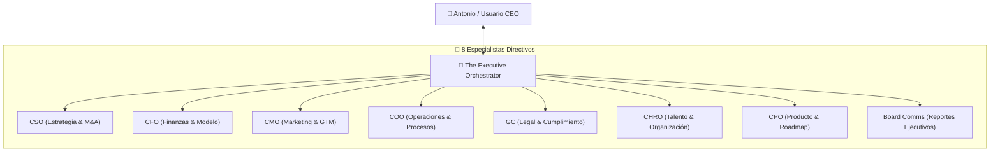

# OpenExecutive C-Suite Agent Skill — Orquestador Ejecutivo Virtual

Esta habilidad integra la arquitectura técnica de **SenteLabsAI/OpenExecutive** para la operación de un equipo directivo virtual unificado que reporta directamente al usuario en lenguaje humano (sin consola de comandos).

---

## 🛠️ Arquitectura y Roles Especializados

---

## 🚀 Características Clave

1. **Voz Ejecutiva Unificada:** El usuario solo interactúa con un Orquestador Ejecutivo que delega internamente en paralelo a los especialistas mediante llamadas `asyncio.gather`.
2. **Reportes Ejecutivos en Lenguaje Natural:** Cero logs de terminal; comunicación ejecutiva diaria vía Telegram, Slack o WhatsApp.
3. **Memoria Episódica en SQLite + ChromaDB:** Persistencia total de decisiones, KPIs corporativos y contexto de negocio.
